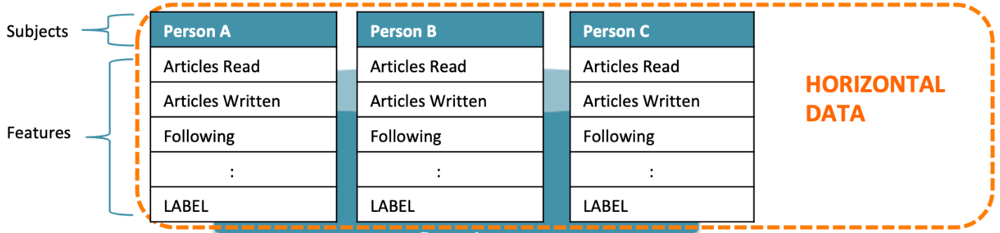
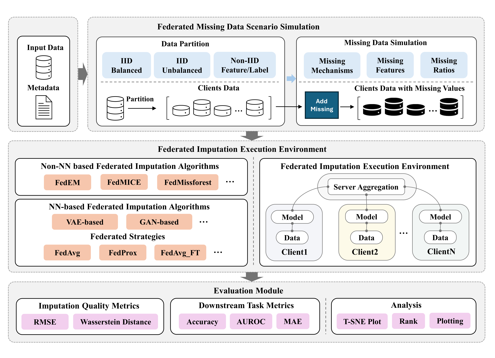

# Overview of FedImpute

FedImpute is an open-source Python package designed to facilitate the simulation, imputation and evaluation of missing data 
in federated learning environments. 
By leveraging advanced statistical and machine learning imputation techniques, 
FedImpute enables collaborative data imputation under federated data scenario. 
This package is ideal for researchers and practitioners working with decentralized datasets with missing data and care about how to
design and evaluate the state-of-art missing data imputation method under federated learning evironment.

## Understanding Missing Data in Horizontal Federated Learning

Missing data occurs when `<NA>` data value is stored for a variable in an observation within a dataset. 
In data analysis, missing data can significantly impact the quality of insights and the performance of predictive models. 
The causes of missing data can vary widely, including data entry errors, non-response in surveys, or interruptions in data collection. 
It's crucial to address these gaps effectively, as improper handling can lead to biased estimates and incorrect conclusions.

### Types of Missing Data
Missing data can be categorized into three types, each with its own implications for data analysis:

- **Missing Completely at Random (MCAR)**: The probability of a data point being missing is the arbitary random.
- **Missing at Random (MAR)**: The probability of a data point being missing is related to other observed variables, but not to the missing data itself.
- **Missing Not at Random (MNAR)**: The probability of a data point being missing is related to the reason it is missing.

For more information on missing data, refer to the [Missing Data Introduction](https://stefvanbuuren.name/fimd/ch-introduction.html).

### Missing Data Under Federated Learning Scenario

Horizontal federated learning (HFL) involves a scenario where multiple parties, each with their own datasets. 
These datasets often have the same feature space but different observations. Usually, a common case of HFL is when the data is distributed across multiple silos, 
for example, hospitals, banks, or research institutions. In these scenarios, missing data can be a significant challenge, as for these common application domains such as healthcare, the missing data is very prevalent.

The missing data scenario under these scenarios can be further complex, because of the following dimensions:

1. **Missing Mechanism Diversity**.  Missing values in the data can occur due to different reasons and are modeled through missing mechanisms, which are categorized into three distinct types depending upon how the missing values are related to the data.
2. **Missing Mechanism Heterogeneity**. Missing values in the same feature can be due to different missing mechanisms across silos.
3. **Data Heterogeneity**. The data across silos can be non-iid to varying degrees. 

### Missing Data Imputation of Federated Datasets

A common approach to handling missing data is imputation, where missing values are estimated based on the observed data. 
More details of imputation methods and their performance can be found in the [How to deal with missing values?](https://rmisstastic.netlify.app/workflows/), [Imputation Book](https://stefvanbuuren.name/fimd/ch-practice.html), [Hyperimpute](https://github.com/vanderschaarlab/hyperimpute).

Under HFL, effective strategies for handling missing data must consider how to unify the decentralized or local imputation techniques, where each party performed independently. By using common federated learning solutions to allow for collaborative imputation without exposing individual data points, we call it **Federated Imputation**.
Due to the reason of the complexity of the problem, it is important to have a benchmarking tool to rapidly evaluate the performance of federated imputation algorithms under different missing data scenarios. **FedImpute** is designed to address this need.

## Features of FedImpute
* **Flexible Missing Data Simulation**: Provide flexible API to simulate missing data scenarios under various missing data distribution and data partition strategies.
* **Built-in Federated Imputation Methods**: Supports multiple imputation techniques, including mean, and model-based approaches, 
tailored for distributed data.
* **Easy Integration**: Designed to be easily extended with federated imputation algorithms and workflows.
* **Customizability**: Offers extensive configuration options to adapt the imputation process to specific needs.

## Architecture and Components

FedImpute is built on top of the following components: **Federated Missing Data Scenario Simulation**, **Federated Imputation Execution Environment**, and **Evaluation**.

* **Federated Missing Data Scenario Simulation**: This component simulates missing data scenarios under various missing data distribution and data partition strategies.
* **Federated Imputation Execution Environment**: This component executes federated imputation algorithms on the simulated missing data scenarios.
* **Evaluation**: This component evaluates the imputation outcomes and provides insights into the performance of the imputation algorithms.

## License
FedImpute is released under the GPL v3.0 License, allowing free use, modification, and distribution of the software. 
This license encourages open collaboration by permitting the incorporation of this package into both open and closed-source projects.
