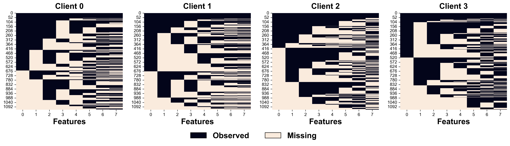

```python
import numpy as np
import pandas as pd
import tabulate
import matplotlib.pyplot as plt

plt.rc('font', family='arial')
plt.rc('pdf', fonttype = 42)
plt.rc('ps', fonttype = 42)
```

# Load Data


```python
%load_ext autoreload
%autoreload 2

from fedimpute.data_prep import load_data, display_data
data, data_config = load_data("codrna")
display_data(data)
print("Data Dimensions: ", data.shape)
print("Data Config:\n", data_config)
```

    +--------+--------+--------+--------+--------+--------+--------+--------+--------+
    |   X1   |   X2   |   X3   |   X4   |   X5   |   X6   |   X7   |   X8   |   y    |
    |--------+--------+--------+--------+--------+--------+--------+--------+--------|
    | 0.7554 | 0.1364 | 0.0352 | 0.4132 | 0.6937 | 0.1591 | 0.3329 | 0.7154 | 1.0000 |
    | 0.7334 | 0.7879 | 0.3819 | 0.3693 | 0.5619 | 0.4830 | 0.4351 | 0.5160 | 0.0000 |
    | 0.7752 | 0.1364 | 0.1761 | 0.3290 | 0.7410 | 0.4259 | 0.4644 | 0.5268 | 1.0000 |
    | 0.5905 | 0.7424 | 0.2720 | 0.2898 | 0.6920 | 0.3205 | 0.4019 | 0.6290 | 1.0000 |
    | 0.7366 | 0.1212 | 0.2465 | 0.3290 | 0.7410 | 0.3249 | 0.5086 | 0.5631 | 1.0000 |
    +--------+--------+--------+--------+--------+--------+--------+--------+--------+
    Data Dimensions:  (5000, 9)
    Data Config:
     {'target': 'y', 'task_type': 'classification', 'natural_partition': False}
    

# Scenario Simulation

## Basic Usage


```python
%load_ext autoreload
%autoreload 2
from fedimpute.scenario import ScenarioBuilder

scenario_builder = ScenarioBuilder()
scenario_data = scenario_builder.create_simulated_scenario(
    data, data_config, num_clients = 4, dp_strategy='iid-even', ms_scenario='mnar-heter'
)
print('Results Structure (Dict Keys):')
print(list(scenario_data.keys()))
scenario_builder.summarize_scenario()
```

    The autoreload extension is already loaded. To reload it, use:
      %reload_ext autoreload
    Missing data simulation...
    Results Structure (Dict Keys):
    ['clients_train_data', 'clients_test_data', 'clients_train_data_ms', 'clients_seeds', 'global_test_data', 'data_config', 'stats']
    ==================================================================
    Scenario Summary
    ==================================================================
    Total clients: 4
    Global Test Data: (500, 9)
    Missing Mechanism Category: MNAR (Self Masking Logit)
    Clients Data Summary:
         Train     Test      Miss     MS Ratio    MS Feature    Seed
    --  --------  -------  --------  ----------  ------------  ------
    C1  (1125,9)  (113,9)  (1125,8)     0.47         8/8        6077
    C2  (1125,9)  (113,9)  (1125,8)     0.51         8/8        577
    C3  (1125,9)  (113,9)  (1125,8)     0.46         8/8        7231
    C4  (1125,9)  (113,9)  (1125,8)     0.47         8/8        5504
    ==================================================================
    
    

## Exploring Scenario


### Data Heterogeneity


```python
scenario_builder.visualize_data_heterogeneity(
    client_ids=[0, 1, 2, 3], 
    distance_method='swd',
    pca_col_threshold=20,
    fontsize=18,
    title=False,
    save_path='./plots/data_heterogeneity.svg'
)
```


    

    


### Missing Data Inspection


```python
scenario_builder.visualize_missing_pattern(client_ids=[0, 1, 2, 3], save_path='./plots/ms_pattern.pdf')
```


    

    


```python
scenario_builder.visualize_missing_distribution(
    client_ids = [0, 1], feature_ids = [0, 1, 2, 3, 4],
    stat = 'proportion', bins = 20, kde=True,
    save_path='./plots/ms_distribution.pdf'
)
```


    

    


# Running Federated Imputation

## Basic Usage


```python
%load_ext autoreload
%autoreload 2
from fedimpute.execution_environment import FedImputeEnv

env = FedImputeEnv(debug_mode=False)
env.configuration(imputer = 'mice', fed_strategy='fedmice')
env.setup_from_scenario_builder(scenario_builder = scenario_builder, verbose=1)
env.show_env_info()
env.run_fed_imputation()
```

    The autoreload extension is already loaded. To reload it, use:
      %reload_ext autoreload
    Setting up clients...
    Setting up server...
    Setting up workflow...
    Environment setup complete.
    ============================================================
    Environment Information:
    ============================================================
    Workflow: ICE (Imputation via Chain Equation)
    Clients:
     - Client 0: imputer: mice, fed-strategy: fedmice
     - Client 1: imputer: mice, fed-strategy: fedmice
     - Client 2: imputer: mice, fed-strategy: fedmice
     - Client 3: imputer: mice, fed-strategy: fedmice
    Server: fed-strategy: fedmice
    ============================================================
    
    


    ICE Iterations:   0%|          | 0/20 [00:00<?, ?it/s]


    Feature_idx:   0%|          | 0/8 [00:00<?, ?it/s]


    Feature_idx:   0%|          | 0/8 [00:00<?, ?it/s]


    Feature_idx:   0%|          | 0/8 [00:00<?, ?it/s]


    Feature_idx:   0%|          | 0/8 [00:00<?, ?it/s]


    Feature_idx:   0%|          | 0/8 [00:00<?, ?it/s]


    Feature_idx:   0%|          | 0/8 [00:00<?, ?it/s]


    Feature_idx:   0%|          | 0/8 [00:00<?, ?it/s]


    Feature_idx:   0%|          | 0/8 [00:00<?, ?it/s]


    Feature_idx:   0%|          | 0/8 [00:00<?, ?it/s]


    Feature_idx:   0%|          | 0/8 [00:00<?, ?it/s]


    Feature_idx:   0%|          | 0/8 [00:00<?, ?it/s]


## Monitoring Imputation Progress


```python
env.tracker.visualize_imputation_process()
```


    

    


# Evaluation

### Imputation Quality


```python
%load_ext autoreload
%autoreload 2
from fedimpute.evaluation import Evaluator

X_trains = env.get_data(client_ids='all', data_type = 'train')
X_train_imps = env.get_data(client_ids='all', data_type = 'train_imp')
X_train_masks = env.get_data(client_ids='all', data_type = 'train_mask')

evaluator = Evaluator()
ret = evaluator.evaluate_imp_quality(
    X_train_imps = X_train_imps,
    X_train_origins = X_trains,
    X_train_masks = X_train_masks,
    metrics = ['rmse', 'nrmse', 'sliced-ws']
)
evaluator.show_imp_results()
```

    The autoreload extension is already loaded. To reload it, use:
      %reload_ext autoreload
    ================================================
    Imputation Quality
    ================================================
                   rmse       nrmse      sliced-ws
    ----------  ----------  ----------  -----------
     Client 1     0.172       0.480        0.076
     Client 2     0.184       0.534        0.090
     Client 3     0.120       0.332        0.047
     Client 4     0.128       0.359        0.058
    ----------  ----------  ----------  ----------
     Average      0.151       0.426        0.068
       Std        0.028       0.083        0.016
    ================================================
    


```python
X_trains = env.get_data(client_ids='all', data_type = 'train')
X_train_imps = env.get_data(client_ids='all', data_type = 'train_imp')

evaluator.tsne_visualization(
    X_imps = X_train_imps,
    X_origins = X_trains,
    seed = 0
)
```

    Evaluating TSNE for Client 1 ...
    Evaluating TSNE for Client 2 ...
    Evaluating TSNE for Client 3 ...
    Evaluating TSNE for Client 4 ...
    


    

    


### Local Prediction


```python
X_trains, y_trains = env.get_data(client_ids='all', data_type = 'train', include_y=True)
X_tests, y_tests = env.get_data(client_ids='all', data_type = 'test', include_y=True)
X_train_imps = env.get_data(client_ids='all', data_type = 'train_imp')
data_config = env.get_data(data_type = 'config')

ret = evaluator.evaluate_local_pred(
    X_train_imps = X_train_imps,
    X_train_origins = X_trains,
    y_trains = y_trains,
    X_tests = X_tests,
    y_tests = y_tests,
    data_config = data_config,
    model = 'nn',
    seed= 0
)
evaluator.show_local_pred_results()
```


    Clients:   0%|          | 0/4 [00:00<?, ?it/s]


    Early stopping at epoch 593
    Early stopping at epoch 287
    Early stopping at epoch 583
    Early stopping at epoch 360
    ==========================================================
    Downstream Prediction (Local)
    ==========================================================
                 accuracy       f1         auc         prc
    ----------  ----------  ----------  ----------  ----------
     Client 1     0.788       0.636       0.861       0.741
     Client 2     0.894       0.824       0.953       0.935
     Client 3     0.929       0.895       0.976       0.969
     Client 4     0.752       0.481       0.854       0.760
    ----------  ----------  ----------  ----------  ----------
     Average      0.841       0.709       0.911       0.851
       Std        0.073       0.162       0.054       0.102
    ==========================================================
    

### Federated Prediction


```python
X_train_imps = env.get_data(client_ids='all', data_type = 'train_imp')
X_trains, y_trains = env.get_data(
    client_ids='all', data_type = 'train', include_y=True
)
X_tests, y_tests = env.get_data(
    client_ids='all', data_type = 'test', include_y=True
)
X_global_test, y_global_test = env.get_data(
    data_type = 'global_test', include_y = True
)
data_config = env.get_data(data_type = 'config')

ret = evaluator.evaluate_fed_pred(
    X_train_imps = X_train_imps,
    X_train_origins = X_trains,
    y_trains = y_trains,
    X_tests = X_tests,
    y_tests = y_tests,
    X_test_global = X_global_test,
    y_test_global = y_global_test,
    data_config = data_config,
    train_params = {
        'global_epoch': 100,
        'local_epoch': 10,
        'fine_tune_epoch': 200,
    },
    seed= 0
)

evaluator.show_fed_pred_results()
```


    Global Epoch:   0%|          | 0/100 [00:00<?, ?it/s]


    Epoch 0 - average loss: 0.6716053117724026
    Epoch 10 - average loss: 0.5709273157750859
    Epoch 20 - average loss: 0.48411076998009406
    Epoch 30 - average loss: 0.4436344894416192
    Epoch 40 - average loss: 0.43356676005265293
    Epoch 50 - average loss: 0.4266376635607551
    Epoch 60 - average loss: 0.4221082873204175
    Early stopping at epoch 65
    Epoch 70 - average loss: 0.40617619396424764
    Early stopping at epoch 71
    Early stopping at epoch 74
    Epoch 80 - average loss: 0.3788260501973769
    Early stopping at epoch 81
    Early stopping at epoch 100
    Early stopping at epoch 121
    Early stopping at epoch 125
    ===============================================================
    Downstream Prediction (Fed)
    ===============================================================
     Personalized    accuracy       f1         auc         prc
    --------------  ----------  ----------  ----------  ----------
       Client 1       0.885       0.831       0.958       0.900
       Client 2       0.920       0.883       0.982       0.956
       Client 3       0.885       0.835       0.975       0.951
       Client 4       0.867       0.819       0.973       0.961
      ----------    ----------  ----------  ----------  ----------
        Global        0.906       0.862       0.969       0.941
    ===============================================================
    

### All In One


```python
%load_ext autoreload
%autoreload 2
from fedimpute.evaluation import Evaluator

evaluator = Evaluator()
ret = evaluator.evaluate_all(
    env, metrics = ['imp_quality', 'pred_downstream_local', 'pred_downstream_fed']
)
evaluator.show_results_all()
```

    Evaluating imputation quality...
    Imputation quality evaluation completed.
    Evaluating downstream prediction...
    


    Clients:   0%|          | 0/4 [00:00<?, ?it/s]


    Early stopping at epoch 593
    Early stopping at epoch 287
    Early stopping at epoch 583
    Early stopping at epoch 360
    Downstream prediction evaluation completed.
    Evaluating federated downstream prediction...
    


    Global Epoch:   0%|          | 0/100 [00:00<?, ?it/s]


    Epoch 0 - average loss: 0.6716053117724026
    Epoch 10 - average loss: 0.5709273157750859
    Epoch 20 - average loss: 0.48411076998009406
    Epoch 30 - average loss: 0.4436344894416192
    Epoch 40 - average loss: 0.43356676005265293
    Epoch 50 - average loss: 0.4266376635607551
    Epoch 60 - average loss: 0.4221082873204175
    Early stopping at epoch 65
    Epoch 70 - average loss: 0.40617619396424764
    Early stopping at epoch 71
    Early stopping at epoch 74
    Epoch 80 - average loss: 0.3788260501973769
    Early stopping at epoch 81
    Early stopping at epoch 100
    Early stopping at epoch 121
    Early stopping at epoch 125
    Federated downstream prediction evaluation completed.
    Evaluation completed.
    


<div>
<style scoped>
    .dataframe tbody tr th:only-of-type {
        vertical-align: middle;
    }

    .dataframe tbody tr th {
        vertical-align: top;
    }

    .dataframe thead tr th {
        text-align: left;
    }
</style>
<table border="1" class="dataframe">
  <thead>
    <tr>
      <th></th>
      <th colspan="3" halign="left">imp_quality</th>
      <th colspan="4" halign="left">pred_downstream_local</th>
      <th colspan="8" halign="left">pred_downstream_fed</th>
    </tr>
    <tr>
      <th></th>
      <th>rmse</th>
      <th>nrmse</th>
      <th>sliced-ws</th>
      <th>accuracy</th>
      <th>f1</th>
      <th>auc</th>
      <th>prc</th>
      <th>personalized_accuracy</th>
      <th>personalized_f1</th>
      <th>personalized_auc</th>
      <th>personalized_prc</th>
      <th>global_accuracy</th>
      <th>global_f1</th>
      <th>global_auc</th>
      <th>global_prc</th>
    </tr>
  </thead>
  <tbody>
    <tr>
      <th>0</th>
      <td>0.172028</td>
      <td>0.479522</td>
      <td>0.075509</td>
      <td>0.787611</td>
      <td>0.636364</td>
      <td>0.860953</td>
      <td>0.741470</td>
      <td>0.884956</td>
      <td>0.831169</td>
      <td>0.958037</td>
      <td>0.900117</td>
      <td>0.906</td>
      <td>0.86217</td>
      <td>0.968807</td>
      <td>0.94098</td>
    </tr>
    <tr>
      <th>1</th>
      <td>0.184269</td>
      <td>0.533933</td>
      <td>0.090226</td>
      <td>0.893805</td>
      <td>0.823529</td>
      <td>0.952703</td>
      <td>0.934722</td>
      <td>0.920354</td>
      <td>0.883117</td>
      <td>0.981508</td>
      <td>0.956229</td>
      <td>0.906</td>
      <td>0.86217</td>
      <td>0.968807</td>
      <td>0.94098</td>
    </tr>
    <tr>
      <th>2</th>
      <td>0.119754</td>
      <td>0.331969</td>
      <td>0.047390</td>
      <td>0.929204</td>
      <td>0.894737</td>
      <td>0.975818</td>
      <td>0.969489</td>
      <td>0.884956</td>
      <td>0.835443</td>
      <td>0.975462</td>
      <td>0.951035</td>
      <td>0.906</td>
      <td>0.86217</td>
      <td>0.968807</td>
      <td>0.94098</td>
    </tr>
    <tr>
      <th>3</th>
      <td>0.128211</td>
      <td>0.359113</td>
      <td>0.057849</td>
      <td>0.752212</td>
      <td>0.481481</td>
      <td>0.854196</td>
      <td>0.760059</td>
      <td>0.867257</td>
      <td>0.819277</td>
      <td>0.972617</td>
      <td>0.961279</td>
      <td>0.906</td>
      <td>0.86217</td>
      <td>0.968807</td>
      <td>0.94098</td>
    </tr>
  </tbody>
</table>
</div>


### Export Evaluation Results in Different Format


```python
evaluator.export_results(format = 'dataframe')
```


<div>
<style scoped>
    .dataframe tbody tr th:only-of-type {
        vertical-align: middle;
    }

    .dataframe tbody tr th {
        vertical-align: top;
    }

    .dataframe thead tr th {
        text-align: left;
    }
</style>
<table border="1" class="dataframe">
  <thead>
    <tr>
      <th></th>
      <th colspan="3" halign="left">imp_quality</th>
      <th colspan="4" halign="left">pred_downstream_local</th>
      <th colspan="8" halign="left">pred_downstream_fed</th>
    </tr>
    <tr>
      <th></th>
      <th>rmse</th>
      <th>nrmse</th>
      <th>sliced-ws</th>
      <th>accuracy</th>
      <th>f1</th>
      <th>auc</th>
      <th>prc</th>
      <th>personalized_accuracy</th>
      <th>personalized_f1</th>
      <th>personalized_auc</th>
      <th>personalized_prc</th>
      <th>global_accuracy</th>
      <th>global_f1</th>
      <th>global_auc</th>
      <th>global_prc</th>
    </tr>
  </thead>
  <tbody>
    <tr>
      <th>0</th>
      <td>0.172028</td>
      <td>0.479522</td>
      <td>0.075509</td>
      <td>0.787611</td>
      <td>0.636364</td>
      <td>0.860953</td>
      <td>0.741470</td>
      <td>0.884956</td>
      <td>0.831169</td>
      <td>0.958037</td>
      <td>0.900117</td>
      <td>0.906</td>
      <td>0.86217</td>
      <td>0.968807</td>
      <td>0.94098</td>
    </tr>
    <tr>
      <th>1</th>
      <td>0.184269</td>
      <td>0.533933</td>
      <td>0.090226</td>
      <td>0.893805</td>
      <td>0.823529</td>
      <td>0.952703</td>
      <td>0.934722</td>
      <td>0.920354</td>
      <td>0.883117</td>
      <td>0.981508</td>
      <td>0.956229</td>
      <td>0.906</td>
      <td>0.86217</td>
      <td>0.968807</td>
      <td>0.94098</td>
    </tr>
    <tr>
      <th>2</th>
      <td>0.119754</td>
      <td>0.331969</td>
      <td>0.047390</td>
      <td>0.929204</td>
      <td>0.894737</td>
      <td>0.975818</td>
      <td>0.969489</td>
      <td>0.884956</td>
      <td>0.835443</td>
      <td>0.975462</td>
      <td>0.951035</td>
      <td>0.906</td>
      <td>0.86217</td>
      <td>0.968807</td>
      <td>0.94098</td>
    </tr>
    <tr>
      <th>3</th>
      <td>0.128211</td>
      <td>0.359113</td>
      <td>0.057849</td>
      <td>0.752212</td>
      <td>0.481481</td>
      <td>0.854196</td>
      <td>0.760059</td>
      <td>0.867257</td>
      <td>0.819277</td>
      <td>0.972617</td>
      <td>0.961279</td>
      <td>0.906</td>
      <td>0.86217</td>
      <td>0.968807</td>
      <td>0.94098</td>
    </tr>
  </tbody>
</table>
</div>


```python
ret = evaluator.export_results(format = 'dict-dataframe')
ret['imp_quality']
```


<div>
<style scoped>
    .dataframe tbody tr th:only-of-type {
        vertical-align: middle;
    }

    .dataframe tbody tr th {
        vertical-align: top;
    }

    .dataframe thead th {
        text-align: right;
    }
</style>
<table border="1" class="dataframe">
  <thead>
    <tr style="text-align: right;">
      <th></th>
      <th>rmse</th>
      <th>nrmse</th>
      <th>sliced-ws</th>
    </tr>
  </thead>
  <tbody>
    <tr>
      <th>0</th>
      <td>0.172028</td>
      <td>0.479522</td>
      <td>0.075509</td>
    </tr>
    <tr>
      <th>1</th>
      <td>0.184269</td>
      <td>0.533933</td>
      <td>0.090226</td>
    </tr>
    <tr>
      <th>2</th>
      <td>0.119754</td>
      <td>0.331969</td>
      <td>0.047390</td>
    </tr>
    <tr>
      <th>3</th>
      <td>0.128211</td>
      <td>0.359113</td>
      <td>0.057849</td>
    </tr>
  </tbody>
</table>
</div>


```python
ret = evaluator.export_results(format = 'dict-dataframe')
ret['pred_downstream_fed']
```


<div>
<style scoped>
    .dataframe tbody tr th:only-of-type {
        vertical-align: middle;
    }

    .dataframe tbody tr th {
        vertical-align: top;
    }

    .dataframe thead th {
        text-align: right;
    }
</style>
<table border="1" class="dataframe">
  <thead>
    <tr style="text-align: right;">
      <th></th>
      <th>personalized_accuracy</th>
      <th>personalized_f1</th>
      <th>personalized_auc</th>
      <th>personalized_prc</th>
      <th>global_accuracy</th>
      <th>global_f1</th>
      <th>global_auc</th>
      <th>global_prc</th>
    </tr>
  </thead>
  <tbody>
    <tr>
      <th>0</th>
      <td>0.884956</td>
      <td>0.831169</td>
      <td>0.958037</td>
      <td>0.900117</td>
      <td>0.906</td>
      <td>0.86217</td>
      <td>0.968807</td>
      <td>0.94098</td>
    </tr>
    <tr>
      <th>1</th>
      <td>0.920354</td>
      <td>0.883117</td>
      <td>0.981508</td>
      <td>0.956229</td>
      <td>0.906</td>
      <td>0.86217</td>
      <td>0.968807</td>
      <td>0.94098</td>
    </tr>
    <tr>
      <th>2</th>
      <td>0.884956</td>
      <td>0.835443</td>
      <td>0.975462</td>
      <td>0.951035</td>
      <td>0.906</td>
      <td>0.86217</td>
      <td>0.968807</td>
      <td>0.94098</td>
    </tr>
    <tr>
      <th>3</th>
      <td>0.867257</td>
      <td>0.819277</td>
      <td>0.972617</td>
      <td>0.961279</td>
      <td>0.906</td>
      <td>0.86217</td>
      <td>0.968807</td>
      <td>0.94098</td>
    </tr>
  </tbody>
</table>
</div>


# Benchmarking Pipeline


```python
%load_ext autoreload
%autoreload 2
from fedimpute.pipeline import FedImputePipeline

pipeline = FedImputePipeline()
pipeline.setup(
    id = 'test_pipeline',
    fed_imp_configs = [
        ('em', ['local', 'fedem'], {}, [{}, {}]),
        ('mice', ['local', 'fedmice'], {}, [{}, {}]),
        ('gain', ['local', 'fedavg'], {}, [{}, {}]),
    ],
    persist_data = False,
    description = 'test'
)

pipeline.pipeline_setup_summary()
```

    The autoreload extension is already loaded. To reload it, use:
      %reload_ext autoreload
    ==============================================================
    Experiment ID: test_pipeline
    ==============================================================
    Description: test
    Persist Data: False
    Evaluation: ['imp_quality', 'local_pred', 'fed_pred']
    Seed: 100330201
    --------------------------------------------------------------
        Imputer    Fed Strategy    Imp Params    Strategy Params
    --  ---------  --------------  ------------  -----------------
     0  em         local           {}            {}
     1  em         fedem           {}            {}
     2  mice       local           {}            {}
     3  mice       fedmice         {}            {}
     4  gain       local           {}            {}
     5  gain       fedavg          {}            {}
    ==============================================================
    
    


```python
pipeline.run_pipeline(
    simulator, repeats = 1, verbose = 1
)
```

    ----------------------------------------------------------------------------------------------------
    Running experiment: 1 / 6
    Imputer: em | Fed Strategy: local |Imp Params: {} | Strategy Params: {}
    Imputation Start ...
    Initial: rmse - 0.2602 ws - 0.1349
    


    Clients:   0%|          | 0/4 [00:00<?, ?it/s]


    EM converged after 3 iterations.
    EM converged after 2 iterations.
    EM converged after 3 iterations.
    EM converged after 4 iterations.
    Final: rmse - 0.2505 ws - 0.1289
    Running time: 2.6570 seconds
    


    Clients:   0%|          | 0/4 [00:00<?, ?it/s]


    Early stopping at epoch 428
    Early stopping at epoch 309
    Early stopping at epoch 576
    Early stopping at epoch 243
    


    Global Epoch:   0%|          | 0/100 [00:00<?, ?it/s]


    Epoch 0 - average loss: 0.6852318048477173
    Epoch 10 - average loss: 0.6026552538661396
    Epoch 20 - average loss: 0.5766739832127796
    Epoch 30 - average loss: 0.5591664016246796
    Epoch 40 - average loss: 0.5472374050056232
    Epoch 50 - average loss: 0.5470328948953572
    Early stopping at epoch 58
    Epoch 60 - average loss: 0.5348919396306954
    Epoch 70 - average loss: 0.5332270299687104
    Early stopping at epoch 71
    Early stopping at epoch 72
    Epoch 80 - average loss: 0.5302949845790863
    Early stopping at epoch 88
    Early stopping at epoch 188
    Early stopping at epoch 197
    Early stopping at epoch 151
    ----------------------------------------------------------------------------------------------------
    Running experiment: 2 / 6
    Imputer: em | Fed Strategy: fedem |Imp Params: {} | Strategy Params: {}
    Imputation Start ...
    Initial: rmse - 0.1832 ws - 0.0911
    


    Iterations:   0%|          | 0/100 [00:00<?, ?it/s]


    Epoch 0: rmse - 0.1561 ws - 0.0746
    Epoch 1: rmse - 0.1513 ws - 0.0695
    Epoch 2: rmse - 0.1490 ws - 0.0670
    Epoch 3: rmse - 0.1477 ws - 0.0656
    Epoch 4: rmse - 0.1470 ws - 0.0648
    Epoch 5: rmse - 0.1465 ws - 0.0642
    Epoch 6: rmse - 0.1462 ws - 0.0639
    Epoch 7: rmse - 0.1462 ws - 0.0638
    All clients converged, iteration 8
    Final: rmse - 0.1462 ws - 0.0638
    Running time: 10.0379 seconds
    


    Clients:   0%|          | 0/4 [00:00<?, ?it/s]


    Early stopping at epoch 596
    Early stopping at epoch 540
    Early stopping at epoch 635
    Early stopping at epoch 342
    


    Global Epoch:   0%|          | 0/100 [00:00<?, ?it/s]


    Epoch 0 - average loss: 0.6680521088487962
    Epoch 10 - average loss: 0.5459251565968289
    Epoch 20 - average loss: 0.49220619745114275
    Epoch 30 - average loss: 0.4334482230684336
    Epoch 40 - average loss: 0.4074271807775778
    Epoch 50 - average loss: 0.40386741827515993
    Early stopping at epoch 56
    Epoch 60 - average loss: 0.39442776698692167
    Early stopping at epoch 61
    Early stopping at epoch 61
    Epoch 70 - average loss: 0.3848865417873158
    Early stopping at epoch 73
    Early stopping at epoch 137
    Early stopping at epoch 77
    Early stopping at epoch 52
    ----------------------------------------------------------------------------------------------------
    Running experiment: 3 / 6
    Imputer: mice | Fed Strategy: local |Imp Params: {} | Strategy Params: {}
    Imputation Start ...
    Initial: rmse - 0.2602 ws - 0.1349
    


    ICE Iterations:   0%|          | 0/20 [00:00<?, ?it/s]


    Feature_idx:   0%|          | 0/8 [00:00<?, ?it/s]


    Epoch 0: rmse - 0.2499 ws - 0.1279
    


    Feature_idx:   0%|          | 0/8 [00:00<?, ?it/s]


    Epoch 1: rmse - 0.2433 ws - 0.1230
    


    Feature_idx:   0%|          | 0/8 [00:00<?, ?it/s]


    Epoch 2: rmse - 0.2388 ws - 0.1194
    


    Feature_idx:   0%|          | 0/8 [00:00<?, ?it/s]


    Epoch 3: rmse - 0.2381 ws - 0.1184
    


    Feature_idx:   0%|          | 0/8 [00:00<?, ?it/s]


    Epoch 4: rmse - 0.2373 ws - 0.1176
    


    Feature_idx:   0%|          | 0/8 [00:00<?, ?it/s]


    Epoch 5: rmse - 0.2368 ws - 0.1170
    


    Feature_idx:   0%|          | 0/8 [00:00<?, ?it/s]


    Epoch 6: rmse - 0.2363 ws - 0.1165
    


    Feature_idx:   0%|          | 0/8 [00:00<?, ?it/s]


    Epoch 7: rmse - 0.2359 ws - 0.1161
    


    Feature_idx:   0%|          | 0/8 [00:00<?, ?it/s]


    Epoch 8: rmse - 0.2357 ws - 0.1160
    


    Feature_idx:   0%|          | 0/8 [00:00<?, ?it/s]


    Epoch 9: rmse - 0.2356 ws - 0.1159
    All clients converged, iteration 9
    Final: rmse - 0.2356 ws - 0.1159
    Running time: 6.4386 seconds
    


    Clients:   0%|          | 0/4 [00:00<?, ?it/s]


    Early stopping at epoch 494
    Early stopping at epoch 243
    Early stopping at epoch 518
    Early stopping at epoch 162
    


    Global Epoch:   0%|          | 0/100 [00:00<?, ?it/s]


    Epoch 0 - average loss: 0.6858881212332669
    Epoch 10 - average loss: 0.5965307898381177
    Epoch 20 - average loss: 0.5716207185212303
    Epoch 30 - average loss: 0.558542685911936
    Epoch 40 - average loss: 0.5497896000742912
    Epoch 50 - average loss: 0.5480287592200672
    Early stopping at epoch 58
    Epoch 60 - average loss: 0.5366446118728788
    Epoch 70 - average loss: 0.5367836806119657
    Early stopping at epoch 72
    Epoch 80 - average loss: 0.529742247041534
    Early stopping at epoch 89
    Epoch 90 - average loss: 0.5179214705439175
    Early stopping at epoch 90
    Early stopping at epoch 127
    ----------------------------------------------------------------------------------------------------
    Running experiment: 4 / 6
    Imputer: mice | Fed Strategy: fedmice |Imp Params: {} | Strategy Params: {}
    Imputation Start ...
    Initial: rmse - 0.1832 ws - 0.0911
    


    ICE Iterations:   0%|          | 0/20 [00:00<?, ?it/s]


    Feature_idx:   0%|          | 0/8 [00:00<?, ?it/s]


    Epoch 0: rmse - 0.1520 ws - 0.0699
    


    Feature_idx:   0%|          | 0/8 [00:00<?, ?it/s]


    Epoch 1: rmse - 0.1502 ws - 0.0679
    


    Feature_idx:   0%|          | 0/8 [00:00<?, ?it/s]


    Epoch 2: rmse - 0.1500 ws - 0.0675
    


    Feature_idx:   0%|          | 0/8 [00:00<?, ?it/s]


    Epoch 3: rmse - 0.1500 ws - 0.0674
    


    Feature_idx:   0%|          | 0/8 [00:00<?, ?it/s]


    Epoch 4: rmse - 0.1502 ws - 0.0674
    


    Feature_idx:   0%|          | 0/8 [00:00<?, ?it/s]


    Epoch 5: rmse - 0.1502 ws - 0.0675
    


    Feature_idx:   0%|          | 0/8 [00:00<?, ?it/s]


    Epoch 6: rmse - 0.1502 ws - 0.0674
    


    Feature_idx:   0%|          | 0/8 [00:00<?, ?it/s]


    Epoch 7: rmse - 0.1511 ws - 0.0677
    All clients converged, iteration 7
    Final: rmse - 0.1511 ws - 0.0677
    Running time: 5.3013 seconds
    


    Clients:   0%|          | 0/4 [00:00<?, ?it/s]


    Early stopping at epoch 651
    Early stopping at epoch 425
    Early stopping at epoch 509
    Early stopping at epoch 378
    


    Global Epoch:   0%|          | 0/100 [00:00<?, ?it/s]


    Epoch 0 - average loss: 0.6697010529391907
    Epoch 10 - average loss: 0.5561447463491384
    Epoch 20 - average loss: 0.4944189243456897
    Epoch 30 - average loss: 0.4401443280717906
    Epoch 40 - average loss: 0.41360662526944103
    Epoch 50 - average loss: 0.4085833233068971
    Early stopping at epoch 56
    Epoch 60 - average loss: 0.3923953058672886
    Early stopping at epoch 61
    Epoch 70 - average loss: 0.3683767879710478
    Early stopping at epoch 72
    Early stopping at epoch 78
    Early stopping at epoch 134
    Early stopping at epoch 116
    Early stopping at epoch 68
    ----------------------------------------------------------------------------------------------------
    Running experiment: 5 / 6
    Imputer: gain | Fed Strategy: local |Imp Params: {} | Strategy Params: {}
    Imputation Start ...
    Initial: rmse - 0.5227 ws - 0.2964
    


    Global Epoch:   0%|          | 0/300 [00:00<?, ?it/s]


    
    Loss: 0.9227 (0.030994)
    
    Loss: 0.7765 (0.024621)
    
    Loss: 0.7120 (0.036262)
    
    Loss: 0.6754 (0.041985)
    
    Loss: 0.6509 (0.043503)
    
    Loss: 0.6347 (0.043024)
    
    Loss: 0.6233 (0.041136)
    
    Loss: 0.6156 (0.040225)
    
    Loss: 0.6076 (0.039028)
    
    Loss: 0.6043 (0.037397)
    
    Loss: 0.6023 (0.037439)
    
    Loss: 0.6000 (0.037890)
    All clients have converged. Stopping training at 114.
    start fine tuning ...
    


    Fine Tuning Epoch: 0it [00:00, ?it/s]


    Final: rmse - 0.2599 ws - 0.1208
    Running time: 99.3960 seconds
    


    Clients:   0%|          | 0/4 [00:00<?, ?it/s]


    Early stopping at epoch 680
    Early stopping at epoch 365
    Early stopping at epoch 377
    Early stopping at epoch 638
    


    Global Epoch:   0%|          | 0/100 [00:00<?, ?it/s]


    Epoch 0 - average loss: 0.6730961957398583
    Epoch 10 - average loss: 0.5978400663417929
    Epoch 20 - average loss: 0.5800157938809956
    Epoch 30 - average loss: 0.5666844884262365
    Epoch 40 - average loss: 0.5555288638262188
    Epoch 50 - average loss: 0.5373793121646433
    Epoch 60 - average loss: 0.5218750028049244
    Epoch 70 - average loss: 0.50243169200771
    Epoch 80 - average loss: 0.487292159567861
    Epoch 90 - average loss: 0.4765385183341363
    Early stopping at epoch 80
    Early stopping at epoch 187
    Early stopping at epoch 148
    ----------------------------------------------------------------------------------------------------
    Running experiment: 6 / 6
    Imputer: gain | Fed Strategy: fedavg |Imp Params: {} | Strategy Params: {}
    Imputation Start ...
    Initial: rmse - 0.5227 ws - 0.2964
    


    Global Epoch:   0%|          | 0/300 [00:00<?, ?it/s]


    
    Loss: 0.9227 (0.030994)
    
    Loss: 0.7917 (0.072330)
    
    Loss: 0.7753 (0.067716)
    
    Loss: 0.7615 (0.063676)
    
    Loss: 0.7482 (0.060218)
    
    Loss: 0.7412 (0.056916)
    
    Loss: 0.7409 (0.056230)
    
    Loss: 0.7415 (0.056552)
    All clients have converged. Stopping training at 74.
    start fine tuning ...
    


    Fine Tuning Epoch: 0it [00:00, ?it/s]


    Final: rmse - 0.2408 ws - 0.1066
    Running time: 71.4822 seconds
    


    Clients:   0%|          | 0/4 [00:00<?, ?it/s]


    Early stopping at epoch 523
    Early stopping at epoch 763
    Early stopping at epoch 332
    Early stopping at epoch 463
    


    Global Epoch:   0%|          | 0/100 [00:00<?, ?it/s]


    Epoch 0 - average loss: 0.6607095686828389
    Epoch 10 - average loss: 0.5904788664158652
    Early stopping at epoch 15
    Epoch 20 - average loss: 0.5443049821199156
    Epoch 30 - average loss: 0.5404780197377299
    Early stopping at epoch 39
    Epoch 40 - average loss: 0.507057719370898
    Epoch 50 - average loss: 0.5046060856650857
    Early stopping at epoch 57
    Early stopping at epoch 59
    


```python
pipeline.plot_pipeline_results(
    metric_aspect = 'fed_pred_personalized',
    plot_type = 'bar',
)
```


    

    


```python
data = pipeline.show_pipeline_results(
    format = 'dataframe',  
    metric_aspect = 'imp_quality',
    metric_name = 'rmse',
    show_round_variation = False
)
data
```


<style type="text/css">
#T_98914 th {
  text-align: center;
}
</style>
<table id="T_98914">
  <thead>
    <tr>
      <th class="blank level0" >&nbsp;</th>
      <th id="T_98914_level0_col0" class="col_heading level0 col0" colspan="2">em</th>
      <th id="T_98914_level0_col2" class="col_heading level0 col2" colspan="2">gain</th>
      <th id="T_98914_level0_col4" class="col_heading level0 col4" colspan="2">mice</th>
    </tr>
    <tr>
      <th class="blank level1" >&nbsp;</th>
      <th id="T_98914_level1_col0" class="col_heading level1 col0" >fedem</th>
      <th id="T_98914_level1_col1" class="col_heading level1 col1" >local</th>
      <th id="T_98914_level1_col2" class="col_heading level1 col2" >fedavg</th>
      <th id="T_98914_level1_col3" class="col_heading level1 col3" >local</th>
      <th id="T_98914_level1_col4" class="col_heading level1 col4" >fedmice</th>
      <th id="T_98914_level1_col5" class="col_heading level1 col5" >local</th>
    </tr>
  </thead>
  <tbody>
    <tr>
      <th id="T_98914_level0_row0" class="row_heading level0 row0" >Client 0</th>
      <td id="T_98914_row0_col0" class="data row0 col0" >0.161 (0.00)</td>
      <td id="T_98914_row0_col1" class="data row0 col1" >0.257 (0.00)</td>
      <td id="T_98914_row0_col2" class="data row0 col2" >0.227 (0.00)</td>
      <td id="T_98914_row0_col3" class="data row0 col3" >0.253 (0.00)</td>
      <td id="T_98914_row0_col4" class="data row0 col4" >0.172 (0.00)</td>
      <td id="T_98914_row0_col5" class="data row0 col5" >0.255 (0.00)</td>
    </tr>
    <tr>
      <th id="T_98914_level0_row1" class="row_heading level0 row1" >Client 1</th>
      <td id="T_98914_row1_col0" class="data row1 col0" >0.162 (0.00)</td>
      <td id="T_98914_row1_col1" class="data row1 col1" >0.269 (0.00)</td>
      <td id="T_98914_row1_col2" class="data row1 col2" >0.210 (0.00)</td>
      <td id="T_98914_row1_col3" class="data row1 col3" >0.257 (0.00)</td>
      <td id="T_98914_row1_col4" class="data row1 col4" >0.184 (0.00)</td>
      <td id="T_98914_row1_col5" class="data row1 col5" >0.246 (0.00)</td>
    </tr>
    <tr>
      <th id="T_98914_level0_row2" class="row_heading level0 row2" >Client 2</th>
      <td id="T_98914_row2_col0" class="data row2 col0" >0.128 (0.00)</td>
      <td id="T_98914_row2_col1" class="data row2 col1" >0.204 (0.00)</td>
      <td id="T_98914_row2_col2" class="data row2 col2" >0.267 (0.00)</td>
      <td id="T_98914_row2_col3" class="data row2 col3" >0.254 (0.00)</td>
      <td id="T_98914_row2_col4" class="data row2 col4" >0.120 (0.00)</td>
      <td id="T_98914_row2_col5" class="data row2 col5" >0.190 (0.00)</td>
    </tr>
    <tr>
      <th id="T_98914_level0_row3" class="row_heading level0 row3" >Client 3</th>
      <td id="T_98914_row3_col0" class="data row3 col0" >0.134 (0.00)</td>
      <td id="T_98914_row3_col1" class="data row3 col1" >0.272 (0.00)</td>
      <td id="T_98914_row3_col2" class="data row3 col2" >0.259 (0.00)</td>
      <td id="T_98914_row3_col3" class="data row3 col3" >0.275 (0.00)</td>
      <td id="T_98914_row3_col4" class="data row3 col4" >0.128 (0.00)</td>
      <td id="T_98914_row3_col5" class="data row3 col5" >0.251 (0.00)</td>
    </tr>
  </tbody>
</table>


