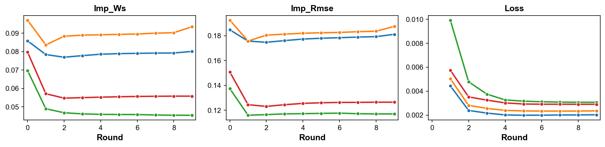

```python
import numpy as np
import pandas as pd
import tabulate
import matplotlib.pyplot as plt

plt.rc('font', family='arial')
plt.rc('pdf', fonttype = 42)
plt.rc('ps', fonttype = 42)
```

# Load Data


```python
%load_ext autoreload
%autoreload 2

from fedimpute.data_prep import load_data, display_data
data, data_config = load_data("codrna")
display_data(data)
print("Data Dimensions: ", data.shape)
print("Data Config:\n", data_config)
```

    +--------+--------+--------+--------+--------+--------+--------+--------+--------+
    |   X1   |   X2   |   X3   |   X4   |   X5   |   X6   |   X7   |   X8   |   y    |
    |--------+--------+--------+--------+--------+--------+--------+--------+--------|
    | 0.7554 | 0.1364 | 0.0352 | 0.4132 | 0.6937 | 0.1591 | 0.3329 | 0.7154 | 1.0000 |
    | 0.7334 | 0.7879 | 0.3819 | 0.3693 | 0.5619 | 0.4830 | 0.4351 | 0.5160 | 0.0000 |
    | 0.7752 | 0.1364 | 0.1761 | 0.3290 | 0.7410 | 0.4259 | 0.4644 | 0.5268 | 1.0000 |
    | 0.5905 | 0.7424 | 0.2720 | 0.2898 | 0.6920 | 0.3205 | 0.4019 | 0.6290 | 1.0000 |
    | 0.7366 | 0.1212 | 0.2465 | 0.3290 | 0.7410 | 0.3249 | 0.5086 | 0.5631 | 1.0000 |
    +--------+--------+--------+--------+--------+--------+--------+--------+--------+
    Data Dimensions:  (5000, 9)
    Data Config:
     {'target': 'y', 'task_type': 'classification', 'natural_partition': False}
    

# Scenario Simulation

## Basic Usage


```python
%load_ext autoreload
%autoreload 2
from fedimpute.scenario import ScenarioBuilder

scenario_builder = ScenarioBuilder()
scenario_data = scenario_builder.create_simulated_scenario(
    data, data_config, num_clients = 4, dp_strategy='iid-even', ms_scenario='mnar-heter'
)
print('Results Structure (Dict Keys):')
print(list(scenario_data.keys()))
scenario_builder.summarize_scenario()
```

    The autoreload extension is already loaded. To reload it, use:
      %reload_ext autoreload
    Missing data simulation...
    Results Structure (Dict Keys):
    ['clients_train_data', 'clients_test_data', 'clients_train_data_ms', 'clients_seeds', 'global_test_data', 'data_config', 'stats']
    ==================================================================
    Scenario Summary
    ==================================================================
    Total clients: 4
    Global Test Data: (500, 9)
    Missing Mechanism Category: MNAR (Self Masking Logit)
    Clients Data Summary:
         Train     Test      Miss     MS Ratio    MS Feature    Seed
    --  --------  -------  --------  ----------  ------------  ------
    C1  (1125,9)  (113,9)  (1125,8)     0.47         8/8        6077
    C2  (1125,9)  (113,9)  (1125,8)     0.51         8/8        577
    C3  (1125,9)  (113,9)  (1125,8)     0.46         8/8        7231
    C4  (1125,9)  (113,9)  (1125,8)     0.47         8/8        5504
    ==================================================================
    
    

## Exploring Scenario


### Data Heterogeneity


```python
scenario_builder.visualize_data_heterogeneity(
    client_ids=[0, 1, 2, 3], 
    distance_method='swd',
    pca_col_threshold=20,
    fontsize=18,
    title=False,
    save_path='./plots/data_heterogeneity.svg'
)
```


    

    


### Missing Data Inspection


```python
scenario_builder.visualize_missing_pattern(client_ids=[0, 1, 2, 3], save_path='./plots/ms_pattern.pdf')
```


    

    


```python
scenario_builder.visualize_missing_distribution(
    client_ids = [0, 1], feature_ids = [0, 1, 2, 3, 4],
    stat = 'proportion', bins = 20, kde=True,
    save_path='./plots/ms_distribution.pdf'
)
```


    

    


# Running Federated Imputation

## Basic Usage


```python
%load_ext autoreload
%autoreload 2
from fedimpute.execution_environment import FedImputeEnv

env = FedImputeEnv(debug_mode=False)
env.configuration(imputer = 'mice', fed_strategy='fedmice')
env.setup_from_scenario_builder(scenario_builder = scenario_builder, verbose=1)
env.show_env_info()
env.run_fed_imputation(verbose=2)
```

    The autoreload extension is already loaded. To reload it, use:
      %reload_ext autoreload
    Setting up clients...
    Setting up server...
    Setting up workflow...
    Environment setup complete.
    ============================================================
    Environment Information:
    ============================================================
    Workflow: ICE (Imputation via Chain Equation)
    Clients:
     - Client 0: imputer: mice, fed-strategy: fedmice
     - Client 1: imputer: mice, fed-strategy: fedmice
     - Client 2: imputer: mice, fed-strategy: fedmice
     - Client 3: imputer: mice, fed-strategy: fedmice
    Server: fed-strategy: fedmice
    ============================================================
    
    Imputation Start ...
    Initial: imp_rmse: 0.1664 imp_ws: 0.0831 
    Epoch 8: loss: 0.0026
    All clients converged, iteration 8
    Final: imp_rmse: 0.1530 imp_ws: 0.0687 
    Finished. Running time: 10.4787 seconds
    

## Monitoring Imputation Progress

```python
env.tracker.visualize_imputation_process()
```


    

    


# Evaluation

### Imputation Quality


```python
%load_ext autoreload
%autoreload 2
from fedimpute.evaluation import Evaluator

X_trains = env.get_data(client_ids='all', data_type = 'train')
X_train_imps = env.get_data(client_ids='all', data_type = 'train_imp')
X_train_masks = env.get_data(client_ids='all', data_type = 'train_mask')

evaluator = Evaluator()
ret = evaluator.evaluate_imp_quality(
    X_train_imps = X_train_imps,
    X_train_origins = X_trains,
    X_train_masks = X_train_masks,
    metrics = ['rmse', 'nrmse', 'sliced-ws']
)
evaluator.show_imp_results()
```

    The autoreload extension is already loaded. To reload it, use:
      %reload_ext autoreload
    ================================================
    Imputation Quality
    ================================================
                   rmse       nrmse      sliced-ws
    ----------  ----------  ----------  -----------
     Client 1     0.181       0.505        0.080
     Client 2     0.187       0.543        0.094
     Client 3     0.117       0.325        0.045
     Client 4     0.126       0.354        0.056
    ----------  ----------  ----------  ----------
     Average      0.153       0.432        0.069
       Std        0.032       0.094        0.019
    ================================================
    


```python
X_trains = env.get_data(client_ids='all', data_type = 'train')
X_train_imps = env.get_data(client_ids='all', data_type = 'train_imp')

evaluator.tsne_visualization(
    X_imps = X_train_imps,
    X_origins = X_trains,
    seed = 0
)
```

    Evaluating TSNE for Client 1 ...
    Evaluating TSNE for Client 2 ...
    Evaluating TSNE for Client 3 ...
    Evaluating TSNE for Client 4 ...
    


    

    


### Local Prediction


```python
X_train_imps, y_trains = env.get_data(client_ids='all', data_type = 'train_imp', include_y=True)
X_tests, y_tests = env.get_data(client_ids='all', data_type = 'test', include_y=True)
X_global_test, y_global_test = env.get_data(data_type = 'global_test', include_y = True)
data_config = env.get_data(data_type = 'config')
```


```python
ret = evaluator.run_local_prediction(
    X_train_imps = X_train_imps,
    y_trains = y_trains,
    X_tests = X_tests,
    y_tests = y_tests,
    data_config = data_config,
    model = 'rf',
    seed= 0
)
evaluator.show_local_prediction_results()
```


    Clients:   0%|          | 0/4 [00:00<?, ?it/s]


    ==========================================================
    Downstream Prediction (Local)
    ==========================================================
                 accuracy       f1         auc         prc
    ----------  ----------  ----------  ----------  ----------
     Client 1     0.894       0.842       0.975       0.946
     Client 2     0.965       0.946       0.996       0.992
     Client 3     0.956       0.932       0.982       0.975
     Client 4     0.920       0.873       0.961       0.924
    ----------  ----------  ----------  ----------  ----------
     Average      0.934       0.898       0.979       0.959
       Std        0.028       0.042       0.013       0.026
    ==========================================================
    


```python
ret = evaluator.run_local_prediction(
    X_train_imps = X_train_imps,
    y_trains = y_trains,
    X_tests = X_tests,
    y_tests = y_tests,
    data_config = data_config,
    model = 'lr',
    seed= 0
)
evaluator.show_local_prediction_results()
```


    Clients:   0%|          | 0/4 [00:00<?, ?it/s]


    ==========================================================
    Downstream Prediction (Local)
    ==========================================================
                 accuracy       f1         auc         prc
    ----------  ----------  ----------  ----------  ----------
     Client 1     0.903       0.871       0.990       0.977
     Client 2     0.903       0.845       0.962       0.935
     Client 3     0.850       0.809       0.950       0.911
     Client 4     0.823       0.778       0.973       0.968
    ----------  ----------  ----------  ----------  ----------
     Average      0.869       0.826       0.968       0.948
       Std        0.034       0.035       0.015       0.027
    ==========================================================
    

### Federated Prediction


```python
ret = evaluator.run_fed_prediction(
    X_train_imps = X_train_imps,
    y_trains = y_trains,
    X_tests = X_tests,
    y_tests = y_tests,
    X_test_global = X_global_test,
    y_test_global = y_global_test,
    data_config = data_config,
    model_name = 'rf',
    seed= 0
)

evaluator.show_fed_prediction_results()
```

    ===============================================================
    Downstream Prediction (Fed)
    ===============================================================
     Personalized    accuracy       f1         auc         prc
    --------------  ----------  ----------  ----------  ----------
       Client 1       0.956       0.932       0.988       0.962
       Client 2       0.956       0.930       0.995       0.989
       Client 3       0.956       0.932       0.995       0.989
       Client 4       0.876       0.800       0.969       0.943
      ----------    ----------  ----------  ----------  ----------
        Global        0.914       0.862       0.952       0.906
    ===============================================================
    


```python
ret = evaluator.run_fed_prediction(
    X_train_imps = X_train_imps,
    y_trains = y_trains,
    X_tests = X_tests,
    y_tests = y_tests,
    X_test_global = X_global_test,
    y_test_global = y_global_test,
    data_config = data_config,
    model_name = 'lr',
    seed= 0
)

evaluator.show_fed_prediction_results()
```

    (900, 8) (900,)
    

                                                                    3.52it/s]

    ===============================================================
    Downstream Prediction (Fed)
    ===============================================================
     Personalized    accuracy       f1         auc         prc
    --------------  ----------  ----------  ----------  ----------
       Client 1       0.912       0.878       0.982       0.955
       Client 2       0.920       0.892       0.996       0.992
       Client 3       0.903       0.867       0.968       0.947
       Client 4       0.876       0.833       0.972       0.960
      ----------    ----------  ----------  ----------  ----------
        Global        0.912       0.878       0.979       0.953
    ===============================================================
    

    

### All In One


```python
%load_ext autoreload
%autoreload 2
from fedimpute.evaluation import Evaluator

evaluator = Evaluator()
ret = evaluator.evaluate_all(
    env, metrics = ['imp_quality', 'pred_downstream_local', 'pred_downstream_fed']
)
evaluator.show_results_all()
```

    Evaluating imputation quality...
    Imputation quality evaluation completed.
    Evaluating downstream prediction...
    


    Clients:   0%|          | 0/4 [00:00<?, ?it/s]


    Early stopping at epoch 593
    Early stopping at epoch 287
    Early stopping at epoch 583
    Early stopping at epoch 360
    Downstream prediction evaluation completed.
    Evaluating federated downstream prediction...
    


    Global Epoch:   0%|          | 0/100 [00:00<?, ?it/s]


    Epoch 0 - average loss: 0.6716053117724026
    Epoch 10 - average loss: 0.5709273157750859
    Epoch 20 - average loss: 0.48411076998009406
    Epoch 30 - average loss: 0.4436344894416192
    Epoch 40 - average loss: 0.43356676005265293
    Epoch 50 - average loss: 0.4266376635607551
    Epoch 60 - average loss: 0.4221082873204175
    Early stopping at epoch 65
    Epoch 70 - average loss: 0.40617619396424764
    Early stopping at epoch 71
    Early stopping at epoch 74
    Epoch 80 - average loss: 0.3788260501973769
    Early stopping at epoch 81
    Early stopping at epoch 100
    Early stopping at epoch 121
    Early stopping at epoch 125
    Federated downstream prediction evaluation completed.
    Evaluation completed.
    


<div>
<style scoped>
    .dataframe tbody tr th:only-of-type {
        vertical-align: middle;
    }

    .dataframe tbody tr th {
        vertical-align: top;
    }

    .dataframe thead tr th {
        text-align: left;
    }
</style>
<table border="1" class="dataframe">
  <thead>
    <tr>
      <th></th>
      <th colspan="3" halign="left">imp_quality</th>
      <th colspan="4" halign="left">pred_downstream_local</th>
      <th colspan="8" halign="left">pred_downstream_fed</th>
    </tr>
    <tr>
      <th></th>
      <th>rmse</th>
      <th>nrmse</th>
      <th>sliced-ws</th>
      <th>accuracy</th>
      <th>f1</th>
      <th>auc</th>
      <th>prc</th>
      <th>personalized_accuracy</th>
      <th>personalized_f1</th>
      <th>personalized_auc</th>
      <th>personalized_prc</th>
      <th>global_accuracy</th>
      <th>global_f1</th>
      <th>global_auc</th>
      <th>global_prc</th>
    </tr>
  </thead>
  <tbody>
    <tr>
      <th>0</th>
      <td>0.172028</td>
      <td>0.479522</td>
      <td>0.075509</td>
      <td>0.787611</td>
      <td>0.636364</td>
      <td>0.860953</td>
      <td>0.741470</td>
      <td>0.884956</td>
      <td>0.831169</td>
      <td>0.958037</td>
      <td>0.900117</td>
      <td>0.906</td>
      <td>0.86217</td>
      <td>0.968807</td>
      <td>0.94098</td>
    </tr>
    <tr>
      <th>1</th>
      <td>0.184269</td>
      <td>0.533933</td>
      <td>0.090226</td>
      <td>0.893805</td>
      <td>0.823529</td>
      <td>0.952703</td>
      <td>0.934722</td>
      <td>0.920354</td>
      <td>0.883117</td>
      <td>0.981508</td>
      <td>0.956229</td>
      <td>0.906</td>
      <td>0.86217</td>
      <td>0.968807</td>
      <td>0.94098</td>
    </tr>
    <tr>
      <th>2</th>
      <td>0.119754</td>
      <td>0.331969</td>
      <td>0.047390</td>
      <td>0.929204</td>
      <td>0.894737</td>
      <td>0.975818</td>
      <td>0.969489</td>
      <td>0.884956</td>
      <td>0.835443</td>
      <td>0.975462</td>
      <td>0.951035</td>
      <td>0.906</td>
      <td>0.86217</td>
      <td>0.968807</td>
      <td>0.94098</td>
    </tr>
    <tr>
      <th>3</th>
      <td>0.128211</td>
      <td>0.359113</td>
      <td>0.057849</td>
      <td>0.752212</td>
      <td>0.481481</td>
      <td>0.854196</td>
      <td>0.760059</td>
      <td>0.867257</td>
      <td>0.819277</td>
      <td>0.972617</td>
      <td>0.961279</td>
      <td>0.906</td>
      <td>0.86217</td>
      <td>0.968807</td>
      <td>0.94098</td>
    </tr>
  </tbody>
</table>
</div>


### Export Evaluation Results in Different Format


```python
evaluator.export_results(format = 'dataframe')
```


<div>
<style scoped>
    .dataframe tbody tr th:only-of-type {
        vertical-align: middle;
    }

    .dataframe tbody tr th {
        vertical-align: top;
    }

    .dataframe thead tr th {
        text-align: left;
    }
</style>
<table border="1" class="dataframe">
  <thead>
    <tr>
      <th></th>
      <th colspan="3" halign="left">imp_quality</th>
      <th colspan="4" halign="left">pred_downstream_local</th>
      <th colspan="8" halign="left">pred_downstream_fed</th>
    </tr>
    <tr>
      <th></th>
      <th>rmse</th>
      <th>nrmse</th>
      <th>sliced-ws</th>
      <th>accuracy</th>
      <th>f1</th>
      <th>auc</th>
      <th>prc</th>
      <th>personalized_accuracy</th>
      <th>personalized_f1</th>
      <th>personalized_auc</th>
      <th>personalized_prc</th>
      <th>global_accuracy</th>
      <th>global_f1</th>
      <th>global_auc</th>
      <th>global_prc</th>
    </tr>
  </thead>
  <tbody>
    <tr>
      <th>0</th>
      <td>0.172028</td>
      <td>0.479522</td>
      <td>0.075509</td>
      <td>0.787611</td>
      <td>0.636364</td>
      <td>0.860953</td>
      <td>0.741470</td>
      <td>0.884956</td>
      <td>0.831169</td>
      <td>0.958037</td>
      <td>0.900117</td>
      <td>0.906</td>
      <td>0.86217</td>
      <td>0.968807</td>
      <td>0.94098</td>
    </tr>
    <tr>
      <th>1</th>
      <td>0.184269</td>
      <td>0.533933</td>
      <td>0.090226</td>
      <td>0.893805</td>
      <td>0.823529</td>
      <td>0.952703</td>
      <td>0.934722</td>
      <td>0.920354</td>
      <td>0.883117</td>
      <td>0.981508</td>
      <td>0.956229</td>
      <td>0.906</td>
      <td>0.86217</td>
      <td>0.968807</td>
      <td>0.94098</td>
    </tr>
    <tr>
      <th>2</th>
      <td>0.119754</td>
      <td>0.331969</td>
      <td>0.047390</td>
      <td>0.929204</td>
      <td>0.894737</td>
      <td>0.975818</td>
      <td>0.969489</td>
      <td>0.884956</td>
      <td>0.835443</td>
      <td>0.975462</td>
      <td>0.951035</td>
      <td>0.906</td>
      <td>0.86217</td>
      <td>0.968807</td>
      <td>0.94098</td>
    </tr>
    <tr>
      <th>3</th>
      <td>0.128211</td>
      <td>0.359113</td>
      <td>0.057849</td>
      <td>0.752212</td>
      <td>0.481481</td>
      <td>0.854196</td>
      <td>0.760059</td>
      <td>0.867257</td>
      <td>0.819277</td>
      <td>0.972617</td>
      <td>0.961279</td>
      <td>0.906</td>
      <td>0.86217</td>
      <td>0.968807</td>
      <td>0.94098</td>
    </tr>
  </tbody>
</table>
</div>


```python
ret = evaluator.export_results(format = 'dict-dataframe')
ret['imp_quality']
```


<div>
<style scoped>
    .dataframe tbody tr th:only-of-type {
        vertical-align: middle;
    }

    .dataframe tbody tr th {
        vertical-align: top;
    }

    .dataframe thead th {
        text-align: right;
    }
</style>
<table border="1" class="dataframe">
  <thead>
    <tr style="text-align: right;">
      <th></th>
      <th>rmse</th>
      <th>nrmse</th>
      <th>sliced-ws</th>
    </tr>
  </thead>
  <tbody>
    <tr>
      <th>0</th>
      <td>0.172028</td>
      <td>0.479522</td>
      <td>0.075509</td>
    </tr>
    <tr>
      <th>1</th>
      <td>0.184269</td>
      <td>0.533933</td>
      <td>0.090226</td>
    </tr>
    <tr>
      <th>2</th>
      <td>0.119754</td>
      <td>0.331969</td>
      <td>0.047390</td>
    </tr>
    <tr>
      <th>3</th>
      <td>0.128211</td>
      <td>0.359113</td>
      <td>0.057849</td>
    </tr>
  </tbody>
</table>
</div>


```python
ret = evaluator.export_results(format = 'dict-dataframe')
ret['pred_downstream_fed']
```


<div>
<style scoped>
    .dataframe tbody tr th:only-of-type {
        vertical-align: middle;
    }

    .dataframe tbody tr th {
        vertical-align: top;
    }

    .dataframe thead th {
        text-align: right;
    }
</style>
<table border="1" class="dataframe">
  <thead>
    <tr style="text-align: right;">
      <th></th>
      <th>personalized_accuracy</th>
      <th>personalized_f1</th>
      <th>personalized_auc</th>
      <th>personalized_prc</th>
      <th>global_accuracy</th>
      <th>global_f1</th>
      <th>global_auc</th>
      <th>global_prc</th>
    </tr>
  </thead>
  <tbody>
    <tr>
      <th>0</th>
      <td>0.884956</td>
      <td>0.831169</td>
      <td>0.958037</td>
      <td>0.900117</td>
      <td>0.906</td>
      <td>0.86217</td>
      <td>0.968807</td>
      <td>0.94098</td>
    </tr>
    <tr>
      <th>1</th>
      <td>0.920354</td>
      <td>0.883117</td>
      <td>0.981508</td>
      <td>0.956229</td>
      <td>0.906</td>
      <td>0.86217</td>
      <td>0.968807</td>
      <td>0.94098</td>
    </tr>
    <tr>
      <th>2</th>
      <td>0.884956</td>
      <td>0.835443</td>
      <td>0.975462</td>
      <td>0.951035</td>
      <td>0.906</td>
      <td>0.86217</td>
      <td>0.968807</td>
      <td>0.94098</td>
    </tr>
    <tr>
      <th>3</th>
      <td>0.867257</td>
      <td>0.819277</td>
      <td>0.972617</td>
      <td>0.961279</td>
      <td>0.906</td>
      <td>0.86217</td>
      <td>0.968807</td>
      <td>0.94098</td>
    </tr>
  </tbody>
</table>
</div>


# regression analysis


```python
X_trains, y_trains = env.get_data(client_ids='all', data_type = 'train', include_y=True)
data_config = env.get_data(data_type = 'config')
data_config['task_type'] = 'classification'

ret = evaluator.run_local_regression_analysis(
    X_train_imps = X_train_imps,
    y_trains = y_trains,
    data_config = data_config
)

evaluator.show_local_regression_results(client_idx = 0)
```

                      Local Logit Regression Results (client 1)                   
    ==============================================================================
    Dep. Variable:                      y   No. Observations:                 1125
    Model:                          Logit   Df Residuals:                     1116
    Method:                           MLE   Df Model:                            8
    Date:                Mon, 21 Apr 2025   Pseudo R-squ.:                  0.2545
    Time:                        16:28:07   Log-Likelihood:                -528.54
    converged:                       True   LL-Null:                       -708.95
    Covariance Type:            nonrobust   LLR p-value:                 4.432e-73
    ==============================================================================
                     coef    std err          z      P>|z|      [0.025      0.975]
    ------------------------------------------------------------------------------
    const         47.6797      4.807      9.919      0.000      38.258      57.101
    X1           -82.3736      7.642    -10.779      0.000     -97.351     -67.396
    X2           -19.5991      2.591     -7.563      0.000     -24.678     -14.520
    X3            10.0812      3.236      3.116      0.002       3.739      16.423
    X4             8.6467      4.951      1.747      0.081      -1.056      18.350
    X5             4.8074      6.234      0.771      0.441      -7.411      17.026
    X6            15.6919      4.340      3.616      0.000       7.187      24.197
    X7            11.8661      4.610      2.574      0.010       2.831      20.901
    X8             5.4795      6.139      0.893      0.372      -6.553      17.512
    ==============================================================================
    


```python
X_trains, y_trains = env.get_data(client_ids='all', data_type = 'train', include_y=True)
data_config = env.get_data(data_type = 'config')
data_config['task_type'] = 'classification'

evaluator.run_fed_regression_analysis(
    X_train_imps = X_train_imps,
    y_trains = y_trains,
    data_config = data_config
)
evaluator.show_fed_regression_results()
```

                          Federated Logit Regression Result                       
    ==============================================================================
    Dep. Variable:                      y   No. Observations:                 4500
    Model:                          Logit   Df Residuals:                     4491
    Method:                           MLE   Df Model:                            8
    Date:                Mon, 21 Apr 2025   Pseudo R-squ.:                  0.2478
    Time:                        16:28:24   Log-Likelihood:                -2133.1
    converged:                       True   LL-Null:                       -2835.8
    Covariance Type:            nonrobust   LLR p-value:                4.035e-298
    ==============================================================================
                     coef    std err          z      P>|z|      [0.025      0.975]
    ------------------------------------------------------------------------------
    const         30.4160      0.129    235.463      0.000      30.163      30.669
    X1           -63.3583      0.231   -274.762      0.000     -63.810     -62.906
    X2           -16.1744      0.064   -254.610      0.000     -16.299     -16.050
    X3            15.2472      0.078    194.635      0.000      15.094      15.401
    X4            11.3237      0.084    134.553      0.000      11.159      11.489
    X5            10.7434      0.103    103.972      0.000      10.541      10.946
    X6            10.6433      0.083    128.952      0.000      10.482      10.805
    X7             8.6910      0.090     96.851      0.000       8.515       8.867
    X8             1.0197      0.114      8.956      0.000       0.797       1.243
    ==============================================================================
    
