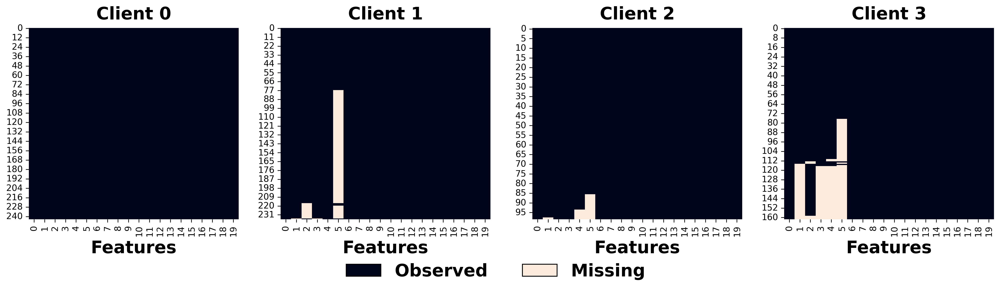
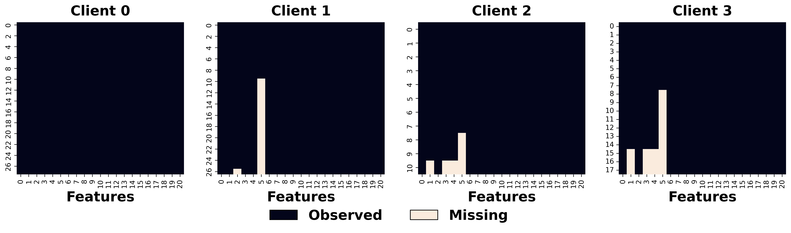

```python
import numpy as np
import pandas as pd
import tabulate
```

# Load Data


```python
%load_ext autoreload
%autoreload 2

from fedimpute.data_prep import load_data, display_data, column_check
from fedimpute.scenario import ScenarioBuilder
data, data_config = load_data("fed_heart_disease")
scenario_builder = ScenarioBuilder()
scenario_data = scenario_builder.create_real_scenario(
    data, data_config,
)
scenario_builder.summarize_scenario()
```

    ==================================================================
    Scenario Summary
    ==================================================================
    Total clients: 4
    Global Test Data: (94, 21)
    Missing Mechanism Category: MCAR
    Clients Data Summary:
         Train     Test      Miss     MS Ratio    MS Feature    Seed
    --  --------  -------  --------  ----------  ------------  ------
    C1  (244,21)  (28,21)  (244,20)     0.00         0/20       6077
    C2  (237,21)  (27,21)  (237,20)     0.04         4/20       577
    C3  (99,21)   (11,21)  (99,20)      0.01         3/20       7231
    C4  (162,21)  (18,21)  (162,20)     0.07         5/20       5504
    ==================================================================
    
    


```python
scenario_builder.visualize_missing_pattern(
    client_ids=[0, 1, 2, 3], data_type='train', fontsize=20, save_path='./plots/real_pattern_train.png'
)
```


    

    


```python
scenario_builder.visualize_missing_pattern(
    client_ids=[0, 1, 2, 3], data_type='test', fontsize=20, save_path='./plots/real_pattern_test.png'
)
```


    

    


# Running Federated Imputation


```python
%load_ext autoreload
%autoreload 2
from fedimpute.execution_environment import FedImputeEnv

env = FedImputeEnv(debug_mode=False)
env.configuration(imputer = 'mice', fed_strategy='fedmice', workflow_params = {})
env.setup_from_scenario_builder(scenario_builder = scenario_builder, verbose=1)
env.show_env_info()
env.run_fed_imputation(verbose=1)
```

    The autoreload extension is already loaded. To reload it, use:
      %reload_ext autoreload
    Setting up clients...
    Setting up server...
    Setting up workflow...
    Environment setup complete.
    ============================================================
    Environment Information:
    ============================================================
    Workflow: ICE (Imputation via Chain Equation)
    Clients:
     - Client 0: imputer: mice, fed-strategy: fedmice
     - Client 1: imputer: mice, fed-strategy: fedmice
     - Client 2: imputer: mice, fed-strategy: fedmice
     - Client 3: imputer: mice, fed-strategy: fedmice
    Server: fed-strategy: fedmice
    ============================================================
    
    Imputation Start ...
    


    ICE Iterations:   0%|          | 0/20 [00:00<?, ?it/s]


    Feature_idx:   0%|          | 0/20 [00:00<?, ?it/s]


    Feature_idx:   0%|          | 0/20 [00:00<?, ?it/s]


    Feature_idx:   0%|          | 0/20 [00:00<?, ?it/s]


    Feature_idx:   0%|          | 0/20 [00:00<?, ?it/s]


    Feature_idx:   0%|          | 0/20 [00:00<?, ?it/s]


    Feature_idx:   0%|          | 0/20 [00:00<?, ?it/s]


    Feature_idx:   0%|          | 0/20 [00:00<?, ?it/s]


    Feature_idx:   0%|          | 0/20 [00:00<?, ?it/s]


    Feature_idx:   0%|          | 0/20 [00:00<?, ?it/s]


    Feature_idx:   0%|          | 0/20 [00:00<?, ?it/s]


    Finished. Running time: 1.0724 seconds
    

# Evaluation


```python
%load_ext autoreload
%autoreload 2
from fedimpute.evaluation import Evaluator

evaluator = Evaluator()

X_trains, y_trains = env.get_data(client_ids='all', data_type = 'train', include_y=True)
X_tests, y_tests = env.get_data(client_ids='all', data_type = 'test', include_y=True)
X_train_imps = env.get_data(client_ids='all', data_type = 'train_imp')
X_test_imps = env.get_data(client_ids='all', data_type = 'test_imp')
data_config = env.get_data(data_type = 'config')

ret = evaluator.evaluate_local_pred(
    X_train_imps = X_train_imps,
    y_trains = y_trains,
    X_tests = X_test_imps,
    y_tests = y_tests,
    data_config = data_config,
    model = 'nn',
    seed= 0
)
evaluator.show_local_pred_results()
```

    The autoreload extension is already loaded. To reload it, use:
      %reload_ext autoreload
    


    Clients:   0%|          | 0/4 [00:00<?, ?it/s]


    Early stopping at epoch 316
    Early stopping at epoch 324
    Early stopping at epoch 249
    Early stopping at epoch 288
    ==========================================================
    Downstream Prediction (Local)
    ==========================================================
                 accuracy       f1         auc         prc
    ----------  ----------  ----------  ----------  ----------
     Client 1     0.607       0.645       0.708       0.742
     Client 2     0.852       0.778       0.953       0.933
     Client 3     0.909       0.952       0.100       0.848
     Client 4     0.722       0.828       0.631       0.799
    ----------  ----------  ----------  ----------  ----------
     Average      0.773       0.801       0.598       0.831
       Std        0.117       0.110       0.311       0.070
    ==========================================================
    

### Federated Prediction


```python
X_train_imps = env.get_data(client_ids='all', data_type = 'train_imp')
X_test_imps = env.get_data(client_ids='all', data_type = 'test_imp')
X_global_test_imp = env.get_data(data_type = 'global_test_imp')

_ , y_trains = env.get_data(
    client_ids='all', data_type = 'train', include_y=True
)
_ , y_tests = env.get_data(
    client_ids='all', data_type = 'test', include_y=True
)
_, y_global_test = env.get_data(
    data_type = 'global_test', include_y = True
)
data_config = env.get_data(data_type = 'config')

ret = evaluator.evaluate_fed_pred(
    X_train_imps = X_train_imps,
    y_trains = y_trains,
    X_tests = X_test_imps,
    y_tests = y_tests,
    X_test_global = X_global_test_imp,
    y_test_global = y_global_test,
    data_config = data_config,
    train_params = {
        'global_epoch': 100,
        'local_epoch': 10,
        'fine_tune_epoch': 200,
    },
    seed= 0
)

evaluator.show_fed_pred_results()
```


    Global Epoch:   0%|          | 0/100 [00:00<?, ?it/s]


    Epoch 0 - average loss: 0.6512317483623822
    Epoch 10 - average loss: 0.5921915372212728
    Early stopping at epoch 11
    Epoch 20 - average loss: 0.544242156876458
    Epoch 30 - average loss: 0.5479222436745962
    Early stopping at epoch 30
    Epoch 40 - average loss: 0.5100965698560079
    Early stopping at epoch 49
    Epoch 50 - average loss: 0.48613545298576355
    Early stopping at epoch 51
    Early stopping at epoch 72
    ===============================================================
    Downstream Prediction (Fed)
    ===============================================================
     Personalized    accuracy       f1         auc         prc
    --------------  ----------  ----------  ----------  ----------
       Client 1       0.679       0.710       0.815       0.838
       Client 2       0.852       0.778       0.976       0.962
       Client 3       0.909       0.952       0.700       0.970
       Client 4       0.833       0.897       0.523       0.716
      ----------    ----------  ----------  ----------  ----------
        Global        0.798       0.812       0.873       0.860
    ===============================================================
    
