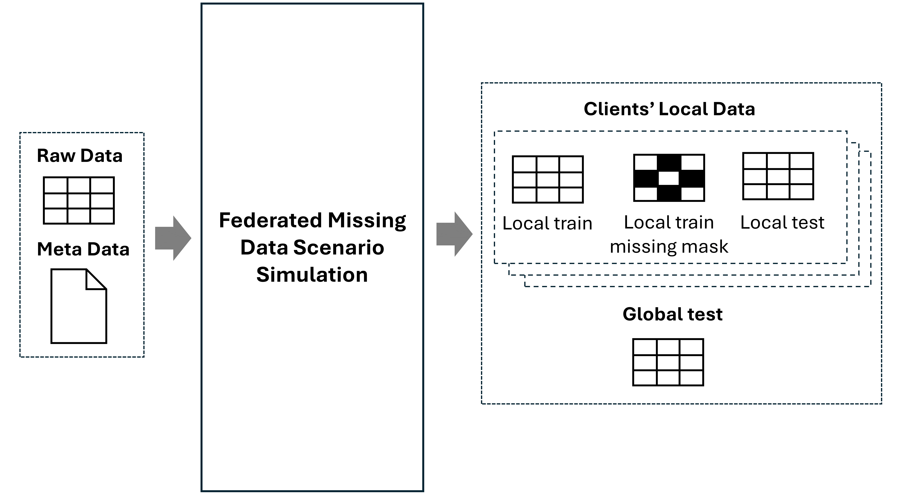

# Simulating Federated Missing Data Scenarios

In this section, we will demonstrate how to simulate federated missing data scenarios using the `fedimpute.simulator` module.

The input to this module is a `<np.ndarray>` dataset and a data configuration dictionary `data_config`. 
Details on how to preparing the dataset and the data configuration dictionary are provided in the [Data Preparation](../user-guide/data_prep.md) section.

## Overview and Basic Usage



The `fedimpute.simulator` module include the following core functionalities: (1) **Data Partition**: Partition the dataset horizontally into multiple clients.
(2) **Missing Data Simulation**: Introduce missing values in the dataset of each client. It takes the data and data configuration as input and perform data partition and missing data simulation logic based on the parameters specified by the user and output the following:

- Clients' local training data
- Clients' local training data missing mask (representing the missing data)
- Clients' local test data (used for downstream local prediction evaluation)
- Global test dataset (used for downstream federated prediction evaluation)

The following example demonstrates how to use `fedimpute.simulator` module. 
Initialize the `Simulator` class and call the `simulate_scenario` method to `simulate_scenario` simulate the federated missing data scenario.

```python
from fedimpute.simulator import Simulator

simulator = Simulator()
simulation_results = simulator.simulate_scenario(
    data, data_config, num_clients = 10, dp_strategy='iid-even', ms_mech_type='mcar', verbose=1
)

# or use the lite simulation function
simulation_results = simulator.simulate_scenario_lite(
  data, data_config, num_clients = 10, dp_strategy='iid-even', ms_scenario='mar-homo', 
  dp_split_col_option = 'target', verbose=1
)
```

## Supported Data Partition Strategies

- **Natural Partition**: this can be done by reading list of datasets, see `data_prep` section in documentation, the input will be list of datasets (federated data) and no further partition will be applied.
- **Artifical Partition**
    - `column`: partition based on discrete values of the column in the dataset
    - `iid-even`: iid partition with even sample sizes
    - `iid-dir`： iid parititon with sample sizes following dirichlet distribution
    - `niid-dir`: non-iid partition based on some columns with dirichlet ditribution
    - `niid-path`: non-iid partition based on some columns with pathological distribution (shard partition)

## Supported Missing Data Mechanism

- `mcar`: MCAR missing mechanism
- `mar-homo`: Homogeneous MAR missing mechansim
- `mar-heter`: Heterogeneous MAR missing mechanism
- `mnar-homo`: Homogeneours MNAR missing mechanism
- `mnar-heter`: Heterogenous MNAR missing mechanism

## Classical Simulation Function - `simulate_scenario`

The `simulate_scenario` method has the following major parameters for data partitioning and missing data simulation.

### Data Partitioning Parameters

The core parameters for data partitioning are number of clients and data partition strategies.

- **num_clients** (int) - Number of clients to partition the dataset.
- **dp_strategy** (str) - Data partitioning strategy. The available strategies are:
    - `natural_column`: Partition the data samples based on values of a categorical column in the dataset, to use this strategy, user need to specify the **dp_split_cols** to be the index of the column to partition based on. If column is continous, it values will be first binned into 20 bins. That column will be dropped out after partitioning the data.
    - `iid-even`: Partition the data samples i.i.d across the clients with equal sample sizes.
    - `iid-dir`: Partition the data samples i.i.d across the clients with sample sizes follows 
    Dirichlet distribtion with parameter **<alpha>** controlled by **dp_size_niid_alpha** parameter.
    - `iid-random`: Partition the data samples i.i.d across the clients with random sample sizes.
    - `iid-hs`: Partition the data samples i.i.d across the clients with hub-and-spoke distribution, one client has significant more samples than the others. 
    - `niid-dir`: Partition the data samples non-i.i.d across the clients with sample sizes follows
    Dirichlet distribtion with parameter **<alpha>** controlled by **dp_niid_alpha** parameter.
    - `niid-path`: Partition the data samples non-i.i.d across the clients with sample sizes follows
    a pathological distribution, each client have two classes of target label.
- **dp_split_cols** (Union[str, int, List[int]]) - Column index or name to split the data samples. If the column is continuous, it will be binned into categories by **dp_reg_bins**.
    - `target`: Split the data samples based on the target column.
    - `first`: Split the data samples based on the first feature column.
    - `random`: Split the data samples based on a random column.
    - `<column index>`: Split the data samples based on the specified column index.

Other Parameters

- **dp_size_niid_alpha** (float) - The parameter for Dirichlet distribution in `iid-dir` strategy.
- **dp_niid_alpha** (float) - The parameter for Dirichlet distribution in `niid-dir` strategy.
- **dp_local_test_size** (float) = 0.1 - The size of local test set for each client for downstream local federated prediction evaluation. 
- **dp_global_test_size** (float) = 0.1 - The size of global test set for the downstream federated prediction evaluation.
- **dp_min_samples** (int) - Minimum number of samples in each client.
- **dp_max_samples** (int) - Maximum number of samples in each client.
- **dp_even_sample_size** (int) - Sample size for each client in `iid-even` strategy. 
- **dp_sample_iid_direct** (bool) -  Instead of partition data i.i.d, sample data i.i.d from global population (original data) for each client.
- **dp_local_backup_size** (float) = 0.05 - backup sample size to avoid all samples in data to be missing
- **dp_reg_bins** (int) = 50 - Used for non-i.i.d data partitioning, if column for non-i.i.d partition is continuous, binning it into categories for meaningful non-i.i.d partiton.

### Missing Data Simulation Parameters

The missing data simulation component is used to simulate missing data in the dataset of each client. 
The core concept here is the **missing data heterogeneity** which means the each client can have a different missing data characteristics in terms of missing ratio, missing feature and missing mechanisms.

The core parameters for missing data simulation are:

- **ms_cols** (Union[str, List[int]]) - features to introduce missing values.
    - `all`: introduce missing values in all features (*default*).
    - `all-num`: introduce missing values in all numerical features.

- **ms_mech_type** (str) - Missing data mechanism type for all clients. The available mechanisms are:
    - `mcar`: Missing Completely At Random (MCAR) mechanism.
    - `mar_sigmoid`: Missing At Random (MAR) mechanism simulated using logistic regression model.
    - `mar_quantile`: Missing At Random (MNAR) mechanism simulated using quantile.
    - `mnar_sigmoid`: Missing Not At Random (MNAR) mechanism simulated using logistic regression model.
    - `mnar_quantile`: Missing Not At Random (MNAR) mechanism simulated using quantile.

- **ms_global_mechanism** (bool) - If True, all clients have the same missing data mechanism. If False, each client has a different missing data mechanism. This is used for control **homogenous** or **heterogeneous** missing data scenario.
- **ms_mr_dist_clients** (str) - Missing ratio distribution across clients. The available options:
    - `fixed`: Missing ratio is the same for all clients.
    - `randu`: Random uniform missing ratio with random float value for each client. 
    - `randu-int`: Random uniform integer missing ratio e.g., 0.1, 0.3 for each client.
    - `randn`: Random normal missing ratio with random float value for each client.
    - `randn-int`: Random normal integer missing ratio e.g., 0.1, 0.3 for each client.
- **ms_mf_dist_clients** (str) - Missing feature distribution across clients. 
    - 'identity': Each client has the same missing features.
- **ms_mm_dist_clients** (str) - Missing mechanism distribution across clients. 
    - 'identity': Each client has the same missing mechanism.
    - 'random': Random missing mechanism function for each client.

Other Parameters

- **ms_mr_lower** (float) = 0.3 - Lower bound of missing ratio 
- **ms_mr_upper** (float) = 0.7 - Upper bound of missing ratio
- **ms_mm_funcs_bank** (str) = 'lr' - missing mechanism function direction bank for MAR, MNAR mechanism. It is a string with any of `l`, `r`, `m`, `t` four types of functions.
    - `l`: left side missing
    - `r`: right side missing
    - `m`: middle missing
    - `t`: two sides missing
- **ms_mm_strictness** (bool) - If True, the missing mechanism function is strict, otherwise it is probabilistic.
- **ms_mm_obs** (bool) = False - This is for MAR mechanism, if True, the missing data is related to some fully observed variables.
- **ms_mm_feature_option** (str) = 'allk=0.2' - This is for MAR, MNAR mechanism, strategies for selecting features which missing value is correlated. 
`allk=<ratio>` means select k (determined by ratio) highly correlated features from all features. 
- **ms_mm_beta_option** (str) = None, strategies set coefficient of logistic function for `mar_sigmoid` and `mnar_sigmoid` mechanism type.

## Lite Simulation Function - Simluting with Predefined Strategies and Scenarios

We provide a lite version of simulation function `simulate_scenario_lite` 
which can be used to simulate the missing data scenario with predefined strategies and scenarios with way fewer parameters for ease of use.

```python
from fedimpute.simulator import Simulator

simulator = Simulator()
simulation_results = simulator.simulate_scenario_lite(
  data, data_config, num_clients = 10, dp_strategy='iid-even', ms_scenario='mar-heter', 
  dp_split_col_option = 'target', verbose=1
)
```

The `simulate_scenario_lite` method has the following major parameters for data partitioning and missing data simulation.

### Data Partitioning Options - `dp_strategy`

- **column@<col_id>**: Partition data based on value of a categorical column
- **iid-even**: Partition the data samples i.i.d across the clients with equal sample sizes.
- **iid-dir@<alpha\>**: Partition the data samples i.i.d across the clients with sample sizes follows dirichlet distribution with parameter `alpha`,e.g. `iid-dir@0.5`.
- **niid-dir@<alpha\>**: Partition the data samples non-i.i.d across the clients with dirichlet distribution with parameter `alpha`,e.g. `niid-dir@0.5`
- **niid-path@<k\>**: Partition the data samples non-i.i.d across the clients with pathological distribution with parameter `k`,e.g. `niid-path@2`.

### Missing Data Simulation Scenarios - `ms_scenario`

- **`mcar`** - Missing Completely At Random (MCAR) mechanism.
```python
    ms_mech_type = 'mcar'
    ms_global_mechanism = False
    ms_mr_dist_clients = 'randu-int'
    ms_mm_dist_clients = 'identity'
    ms_mm_beta_option = None
    ms_mm_obs = False
```
- **`mar-heter`** - Missing At Random (MAR) mechanism with heterogeneous missing data scenario.
```python
    ms_mech_type = 'mar_sigmoid'
    ms_global_mechanism = False
    ms_mr_dist_clients = 'randu-int'
    ms_mm_dist_clients = 'identity'
    ms_mm_beta_option = 'randu'
    ms_mm_obs = True
```
- **`mar-homo`** - Missing At Random (MAR) mechanism with homogeneous missing data scenario.
```python
    ms_mech_type = 'mar_sigmoid'
    ms_global_mechanism = True
    ms_mr_dist_clients = 'randu-int'
    ms_mm_dist_clients = 'identity'
    ms_mm_beta_option = 'fixed'
    ms_mm_obs = True
```
- **`mnar-heter`** - Missing Not At Random (MNAR) mechanism with heterogeneous missing data scenario.
```python
    ms_mech_type = 'mnar_sigmoid'
    ms_global_mechanism = False
    ms_mr_dist_clients = 'randu-int'
    ms_mm_dist_clients = 'identity'
    ms_mm_beta_option = 'self'
    ms_mm_obs = False
```
- **`mnar-homo`** - Missing Not At Random (MNAR) mechanism with homogeneous missing data scenario.
```python
    ms_mech_type = 'mnar_sigmoid'
    ms_global_mechanism = True
    ms_mr_dist_clients = 'randu-int'
    ms_mm_dist_clients = 'identity'
    ms_mm_beta_option = 'self'
    ms_mm_obs = False
```