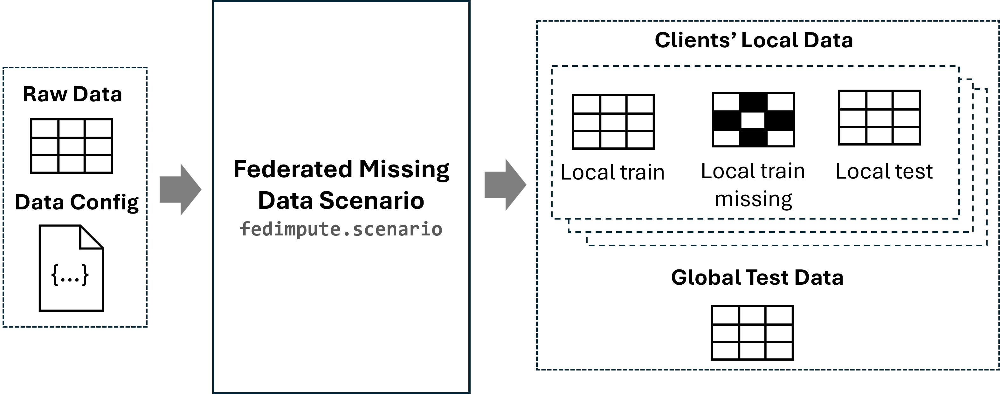

# Constructing Distributed Missing Data Scenarios

This page describes how to build federated missing-data scenarios with
`fedimpute.scenario.ScenarioBuilder`.

## What a Scenario Contains

A distributed missing-data scenario represents a horizontal federated setting:
each client owns rows from the same feature space, and each local training
dataset can contain missing feature values. `ScenarioBuilder` prepares the
standard data components used by the rest of FedImpute:

- `clients_train_data`: complete client training datasets, including target.
- `clients_train_data_ms`: client training feature matrices with missing values.
  The target column is not included.
- `clients_test_data`: client test datasets, including target.
- `global_test_data`: global test dataset for federated evaluation.
- `clients_seeds`: per-client random seeds generated from the global seed.
- `data_config`: the data configuration used for scenario construction.
- `stats`: partition statistics returned by the data-partition step.

The input can be either a centralized `numpy.ndarray` or `pandas.DataFrame` for
simulation-based scenarios, or a list of naturally partitioned client datasets
for real scenarios. The data configuration should include at least
`task_type` and the target-column information described in
[Data Preparation](../user-guide/data_prep.md).



## Simulated Scenarios

Use `create_simulated_scenario()` when you want FedImpute to split a centralized
dataset into clients and then simulate missing values in each client's training
data.

```python
from fedimpute.scenario import ScenarioBuilder

scenario_builder = ScenarioBuilder()
scenario_data = scenario_builder.create_simulated_scenario(
    data,
    data_config,
    num_clients=4,
    dp_strategy="iid-even",
    ms_scenario="mnar-heter",
    seed=100330201,
)

print(list(scenario_data.keys()))
scenario_builder.summarize_scenario()
```

### Data Partitioning

Set the data partition through `dp_strategy`.

| Strategy | Description |
| --- | --- |
| `iid-even` | IID partition with equal expected client sizes. |
| `iid-dir@<alpha>` | IID feature/label distribution with heterogeneous client sizes sampled from a Dirichlet distribution. Smaller `alpha` gives stronger size heterogeneity. |
| `niid-dir@<alpha>` | Non-IID partition based on `dp_split_cols`, using a Dirichlet distribution. Smaller `alpha` gives stronger distribution heterogeneity. |
| `niid-path@<n>` | Parsed by the builder but not implemented yet. It currently raises `NotImplementedError`. |

Other partition parameters:

- `num_clients`: number of clients.
- `dp_split_cols`: split basis for `niid-dir`. Supported values in
  `ScenarioBuilder` are `target`, `feature`, or an integer feature index.
  `target` uses the target column; `feature` uses the first feature column.
- `dp_min_samples`: minimum samples required for each client during non-IID
  allocation.
- `dp_max_samples`: maximum samples for heterogeneous-size IID allocation.
- `dp_sample_iid_direct`: when `True`, IID clients are sampled directly from the
  global population.
- `dp_local_test_size`: local test split ratio for each client.
- `dp_global_test_size`: global test split ratio before client partitioning.
- `dp_local_backup_size`: fraction of local backup rows appended to training
  outputs without simulated missing values.
- `dp_reg_bins`: number of bins used when a continuous target or split feature
  must be discretized for partitioning.

### Missing Mechanisms

Set the mechanism with `ms_mech_type` when not using a predefined
`ms_scenario`.

| Mechanism | Description |
| --- | --- |
| `mcar` | Missing completely at random. |
| `mar_quantile` | MAR using quantile-based masking from observed features. |
| `mar_logit` | MAR using logistic masking from observed features. |
| `mnar_quantile` | MNAR using quantile-based masking. |
| `mnar_logit` | MNAR using logistic masking from the feature itself and related features. |
| `mnar_sm_logit` | Self-masking MNAR using logistic masking from the feature itself. |

Use `obs_cols` for MAR settings:

- `random`: choose one observed feature with the scenario seed.
- `rest`: use all non-missing columns as observed features. If `ms_cols="all"`,
  the builder keeps one missing column as the observed feature fallback.
- `List[int]`: explicit observed feature indices.

For non-MAR mechanisms, `mm_obs` is forced to `False` internally.

### Missing Feature Selection

Use `ms_cols` to choose which feature columns may receive missing values:

- `all`: all feature columns.
- `all-num`: the first `data_config["num_cols"]` feature columns.
- `List[int]`: explicit zero-based feature indices.

`ms_missing_features` controls the missing-feature strategy passed to the lower
level simulator. The current implemented strategy is `all`, meaning every
feature selected by `ms_cols` is eligible for missingness for each client.

### Missing Ratios

Missing ratios are controlled by two parameters:

- `ms_mr_clients`: the target ratio or ratio range for each client.
- `ms_mr_dist_clients`: how feature-level ratios are sampled from those ranges.

Supported `ms_mr_dist_clients` values are:

| Value | Behavior |
| --- | --- |
| `random` | Uniformly sample ratios inside each client's range. |
| `random-int` | Sample discrete ratios inside each client's range using 0.1-spaced values. |
| `normal` | Sample from a truncated normal distribution inside each client's range. |

`ms_mr_clients` accepts these forms:

```python
# Same fixed ratio for every client
ms_mr_clients = 0.4

# Same ratio range for every client
ms_mr_clients = (0.2, 0.6)

# Per-client settings; list length must equal num_clients
ms_mr_clients = [0.2, (0.3, 0.5), "large"]
```

Predefined ratio buckets are:

| Bucket | Range |
| --- | --- |
| `extra-small` | `(0.1, 0.2)` |
| `small` | `(0.2, 0.4)` |
| `moderate` | `(0.4, 0.6)` |
| `large` | `(0.6, 0.8)` |
| `extra-large` | `(0.8, 0.9)` |

`ms_mr_lower` and `ms_mr_upper` are hard clipping bounds applied after ratios
are sampled. Both must be between 0 and 1, and `ms_mr_lower <= ms_mr_upper`.

When `ms_global_mechanism=True`, missingness is simulated once on the combined
training data and then split back to clients. In that mode, use a scalar, tuple,
or bucket string for `ms_mr_clients`; per-client lists are rejected.

### Missing Function Heterogeneity

For quantile and logistic mechanisms, `ms_mm_funcs_bank` defines the function
directions available to the simulator:

| Value | Function directions |
| --- | --- |
| `None` | No direction function. |
| `l` | left |
| `r` | right |
| `m` | middle |
| `t` | tail |
| `lr` | left, right |
| `mt` | middle, tail |
| `all` | left, right, middle, tail |

`ms_mm_dist_clients` controls how these functions are assigned:

- `identity`: each feature uses the same sampled function across clients.
- `random`: each client-feature pair samples a function independently. The
  function bank must contain at least two options.
- `random2`: shuffles two function options across clients for each feature.

Additional mechanism parameters:

- `ms_mm_strictness`: if `True`, masking is deterministic after the mechanism
  score is computed; otherwise it is probabilistic.
- `ms_mm_obs`: for MAR, use observed features to drive missingness.
- `ms_mm_feature_option`: related-feature strategy for logistic mechanisms,
  such as `self`, `all`, or `allk=0.2`.
- `ms_mm_beta_option`: logistic coefficient strategy. Common values are
  `fixed` or `randu` for MAR, and `self` or `randu` for MNAR.

### Predefined Missing Scenarios

`ms_scenario` provides common mechanism presets. When this argument is set, it
overrides `ms_mech_type`, `ms_global_mechanism`, `ms_mr_dist_clients`,
`ms_mm_dist_clients`, `ms_mm_beta_option`, and `ms_mm_obs`.

| `ms_scenario` | Mechanism | Global mechanism | Ratio distribution | Function distribution | Beta option | Observed-feature mode |
| --- | --- | --- | --- | --- | --- | --- |
| `mcar` | `mcar` | `False` | `random` | `identity` | `None` | `False` |
| `mar-homo` | `mar_logit` | `True` | `random` | `identity` | `fixed` | `True` |
| `mar-heter` | `mar_logit` | `False` | `random` | `random` | `randu` | `True` |
| `mnar-homo` | `mnar_sm_logit` | `True` | `random` | `identity` | `self` | `False` |
| `mnar-heter` | `mnar_sm_logit` | `False` | `random` | `random` | `self` | `False` |

Example with explicit per-client missing-ratio settings:

```python
scenario_data = scenario_builder.create_simulated_scenario(
    data,
    data_config,
    num_clients=3,
    dp_strategy="iid-even",
    ms_scenario="mcar",
    ms_mr_clients=[0.2, (0.4, 0.6), "large"],
    ms_mr_lower=0.1,
    ms_mr_upper=0.9,
    seed=123,
)
```

## Real Scenarios

Use `create_real_scenario()` when your data is already partitioned by client and
already contains the missing values you want to study. The input is a list of
client datasets. Each item can be a `pandas.DataFrame` or `numpy.ndarray`.

```python
from fedimpute.data_prep import load_data
from fedimpute.scenario import ScenarioBuilder

datas, data_config = load_data("fed_heart_disease")

scenario_builder = ScenarioBuilder()
scenario_data = scenario_builder.create_real_scenario(
    datas,
    data_config,
    seed=100330201,
)

scenario_builder.summarize_scenario()
```

Parameters:

- `datas`: list of client datasets.
- `data_config`: data configuration.
- `seed`: random seed for client seeds and train-test splitting.
- `verbose`: print progress information when greater than 0.

## Scenario Summary and Visualization

`ScenarioBuilder` keeps the latest scenario on the builder instance, so the
summary and visualization methods can be called after scenario construction.

### `summarize_scenario()`

Prints a table with client train/test/missing-data shapes, total missing ratio,
number of missing features, and client seed.

```python
scenario_builder.summarize_scenario()

summary = scenario_builder.summarize_scenario(return_summary=True)
```

Optional parameters:

- `log_to_file`: write the summary to disk.
- `file_path`: output path used when `log_to_file=True`.
- `return_summary`: return the summary string instead of printing it.

### `visualize_missing_pattern()`

Visualizes the missing-value mask for selected clients.

```python
scenario_builder.visualize_missing_pattern(
    client_ids=[0, 1, 2, 3],
    data_type="train",
)
```

Useful parameters:

- `client_ids`: zero-based client ids.
- `data_type`: `train` or `test`.
- `save_path`: save the plot instead of showing it.

### `visualize_missing_distribution()`

Compares observed and missing-value distributions for selected features and
clients.

```python
scenario_builder.visualize_missing_distribution(
    client_ids=[0, 1],
    feature_ids=[0, 1, 2, 3, 4],
)
```

Useful parameters:

- `client_ids`: zero-based client ids.
- `feature_ids`: zero-based feature ids.
- `bins`, `stat`, `kde`: histogram controls passed to seaborn.
- `data_type`: `train` or `test`.
- `save_path`: save the plot instead of showing it.

### `visualize_data_heterogeneity()`

Computes and visualizes pairwise client distance matrices.

```python
scenario_builder.visualize_data_heterogeneity(
    client_ids=[0, 1, 2, 3],
    distance_method="swd",
)
```

Supported distance methods:

- `swd`: sliced Wasserstein distance.
- `correlation`: distance based on feature-correlation matrices.
