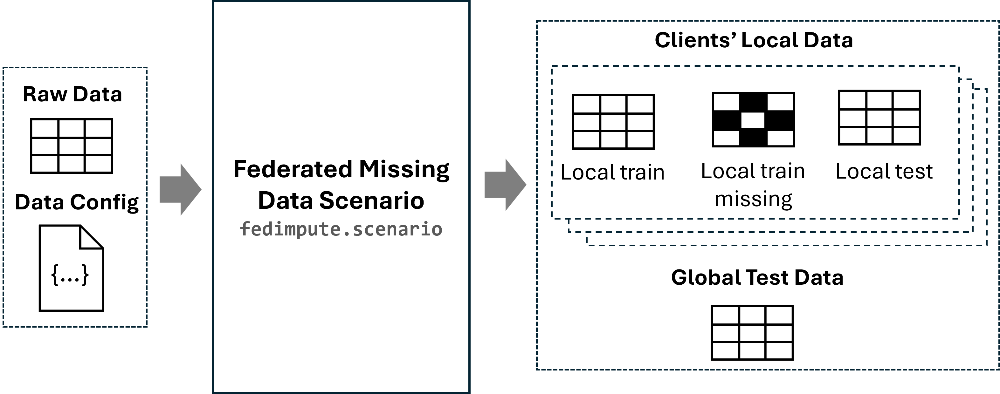

# Constructing Distributed (Federated) Missing Data Scenarios

In this section, we will demonstrate how to construct federated missing data scenarios using the `fedimpute.scenario.ScenarioBuilder` module. 

## What is Distributed Missing Data Scenario

Distributed Missing Data Scenario represents a distributed network with a number of clients. Each client has its local dataset (we consider horizontal setting, which means these datasets contain same feature space). There are missing values inside local dataset of these clients. Our `fedimpute.scenario.ScenarioBuilder` module will construct all necessary components for the distributed missing data scenario (e.g., client-specific training and test data, missing data, etc.), which will be used in other modules for conducting federated imputation and prediction. 



The input to this module is a `<np.ndarray>` or `<pd.DataFrame>` dataset or datasets (real federated datasets) and a data configuration dictionary `data_config`. 
Details on how to preparing the dataset and the data configuration dictionary are provided in the [Data Preparation](../user-guide/data_prep.md) section.

`fedimpute.scenario.ScenarioBuilder` provides two approaches for scenario construction that cover the most common research settings in distributed imputation: (1) **simulation-based scenarios**, where data partitioning and missing values are systematically simulated according to user-specified parameters, and (2) **real-world scenarios**, where data is naturally partitioned across silos with existing missing values. 

Both approaches output standard formats of data components (1) `clients_train_data`: client-specific training datasets, (2) `clients_train_data_ms`: client-specific training datasets
with simulated or existed missing values, (3) `clients_test_data`: client-specific test datasets for local evaluation, and (4) `global_test_data`: global test dataset for federated evaluation. These structured outputs serve as consistent building blocks for subsequent steps in the fedimpute workflow, including distributed environment initialization, algorithm execution, and performance evaluation.

## Scenario Construction Interface

### Constructing Simulated Scenario

The `fedimpute.scenario.ScenarioBuilder` module include the following core functionalities for constructing a simulated scenario: (1) **Data Partition**: Partition the dataset horizontally into multiple clients. (2) **Missing Data Simulation**: Introduce missing values in the dataset of each client. It takes the a centralized `<np.ndarray>` or `<pd.DataFrame>` data and data configuration as input and perform data partition and missing data simulation logic based on the parameters specified by the user and output the client-specific data components (clients' local training data, test etc.)

The following example shows how to construct a simulated scenario. Firstly, initialize the `fedimpute.scenario.ScenarioBuilder` class and call the `create_simulated_scenario` method to simulate the federated missing data scenario.

```python
from fedimpute.scenario import ScenarioBuilder

scenario_builder = ScenarioBuilder()
scenario_data = scenario_builder.create_simulated_scenario(
    data, data_config, num_clients = 4, dp_strategy='iid-even', ms_scenario='mnar-heter'
)
print('Results Structure (Dict Keys):')
print(list(scenario_data.keys()))
scenario_builder.summarize_scenario()
```

#### Supported Data Partition Strategies
Data partition can be set by  `dp_strategy` parameter, which takes following options

- `iid-even`: iid partition with even sample sizes
- `iid-dir@<alpha>`： iid parititon with sample sizes following dirichlet distribution with parameter `alpha` to control sample size heterogeneity e.g. `iid-dir@0.1`
- `niid-dir@<alpha>`: non-iid partition based on some columns with dirichlet ditribution with parameter `alpha` to control data heterogneity e.g. `niid-dir@0.1`
- `niid-path@<n>`: non-iid partition based on some columns with pathological distribution (shard partition) with parameter `n` control heterogeneity `niid-path@2`, each client own 2 classes of a column values.

#### Other Parameters for Data Partition

- **num_clients** (int) - Number of clients to partition the dataset.
- **dp_split_cols** (Union[str, int, List[int]]) - Column index or name to split the data samples. If the column is continuous, it will be binned into categories by `dp_reg_bins`.
    - `target`: Split the data samples based on the target column.
    - `feature`: Split the data samples based on the first feature column.
- **dp_min_samples** (int) - Minimum number of samples in each client.
- **dp_max_samples** (int) - Maximum number of samples in each client.
- **dp_sample_iid_direct** (bool) -  Instead of partition data i.i.d, sample data i.i.d from global population (original data) for each client.
- **dp_local_test_size** (float) = 0.1 - The size of local test set for each client for downstream local federated prediction evaluation. 
- **dp_global_test_size** (float) = 0.1 - The size of global test set for the downstream federated prediction evaluation.
- **dp_local_backup_size** (float) = 0.05 - backup sample size to avoid all samples in data to be missing
- **dp_reg_bins** (int) = 50 - Used for non-i.i.d data partitioning, if column for non-i.i.d partition is continuous, binning it into categories for meaningful non-i.i.d partiton.

#### Supported Missing Data Mechanism Type

Missing mechansim can be set by `ms_mech_type` parameter, which supports all commonly used three types of general missing mechanism. The options are shown as below. Refer to [how to create missingness in python?](https://rmisstastic.netlify.app/how-to/python/generate_html/how%20to%20generate%20missing%20values) for more details.

- **MCAR Missing Mechanism** 
    - `mcar` missing completely at random implemented using purely random mask.
- **MAR Missing Mechanism**
    - `mar_quantile`: missing at random based on quantile of values of other features.
    - `mar_logit` missing at random created based on logit regressoin on values of other features.
- **MNAR Missing Mechanism**
    - `mnar_logit`: missingness based on values of feature itself and other features.
    - `mnar_sm_logit`: self-masking missingness logit regression based on values of feature itself.
    - `mnar_sm_quantile`: self-masking missingness based on quantile of values of feature itself.

#### Missing Data Simulation Parameters

The missing data simulation component is used to simulate missing data in the dataset of each client. 
The core concept here is the **missing data heterogeneity** which means the each client can have a different missing data characteristics in terms of missing ratio, missing feature and missing mechanisms.

The core parameters for missing data simulation are:

- **ms_cols** (Union[str, List[int]]) - features to introduce missing values.
    - `all`: introduce missing values in all features (*default*).
    - `all-num`: introduce missing values in all numerical features.

- **ms_global_mechanism** (bool) - If True, all clients have the same missing data mechanism. If False, each client has a different missing data mechanism. This is used for control **homogenous** or **heterogeneous** missing data scenario.
- **ms_mr_dist_clients** (str) - Missing ratio distribution across clients. The available options:
    - `fixed`: Missing ratio is the same for all clients.
    - `randu`: Random uniform missing ratio with random float value for each client. 
    - `randn`: Random normal missing ratio with random float value for each client.
- **ms_mf_dist_clients** (str) - Missing feature distribution across clients. 
    - `identity`: Each client has the same missing features.
- **ms_mm_dist_clients** (str) - Missing mechanism distribution across clients. 
    - `identity`: Each client has the same missing mechanism.
    - `random`: Random missing mechanism function for each client.

We have another parameter `ms_scenario` which simplify the missing data heterogeneity simulation by providing 5 predefined homogeneous and heterogeneous mechanism settings. It has the following options (**Note:** by setting this parameter, you don't need to specify the parameter above for missing mechanism heterogeneity):
- `mcar`: MCAR setting
- `mar-heter`: heterogeneous MAR setting
- `mar-homo`: homogeneous MAR setting
- `mnar-heter`: heterogeneous MNAR setting
- `mnar-homo`: homogenous MNAR setting


Other Parameters

- **ms_mr_lower** (float) = 0.3 - Lower bound of missing ratio 
- **ms_mr_upper** (float) = 0.7 - Upper bound of missing ratio
- **ms_mm_funcs_bank** (str) = 'lr' - missing mechanism function direction bank for MAR, MNAR mechanism. It is a string with any of `l`, `r`, `m`, `t` four types of functions.
    - `l`: left side missing
    - `r`: right side missing
    - `m`: middle missing
    - `t`: two sides missing
- **ms_mm_strictness** (bool) - If True, the missing mechanism function is strict, otherwise it is probabilistic.
- **ms_mm_obs** (bool) = False - This is for MAR mechanism, if True, the missing data is related to some fully observed variables.
- **ms_mm_feature_option** (str) = 'allk=0.2' - This is for MAR, MNAR mechanism, strategies for selecting features which missing value is correlated. 
`allk=<ratio>` means select k (determined by ratio) highly correlated features from all features. 
- **ms_mm_beta_option** (str) = None, strategies set coefficient of logistic function for `mar_logit` and `mnar_sm_logit`, `mnar_logit` mechanism type.

### Constructing Real Scenario

In certain cases, we have real data available with naturally occurring missing values and has well-defined partitions for distribution. To handle such cases, the module provides the `create_real_scenario()` method to construct distributed missing data scenario corresponding to the given data. Unlike simulation-based construction,
this method expects input data as a Python `List of <pandas.DataFrame>` datasets, where each
dataframe represents a client-specific local dataset. The method processes these distributed
datasets to generate scenario components in the same standardized format described earlier (e.g. split training and test data for each client's local data and construct a global test dataset for federated prediction), ensuring consistent interfaces for subsequent distributed imputation and evaluation.

**Parameters**:

- `datas` (List[pd.DataFrame]): input list of datasets
- `data_config` (Dict): data configuration
- `seed` (int): random seed for train-test splitting
- `verbose` (int): show processing information

**Usage**:

```{python}
from fedimpute.data_prep import load_data, display_data, column_check
from fedimpute.scenario import ScenarioBuilder
data, data_config = load_data("fed_heart_disease")
scenario_builder = ScenarioBuilder()
scenario_data = scenario_builder.create_real_scenario(
    data, data_config,
)
scenario_builder.summarize_scenario()
```

## Scenario Exploration and Summary

The module also provides comprehensive tools for analyzing scenario-specific
data for any given distributed missing data scenario through a collection of visualization and
analysis interfaces, example of these functions can be found in the tutorials. It includes the following APIs:

- **`summarize_scenario(log_to_file, file_path)`** provides a summary report of the scenario data components, user can choose whether show the summary to save summary report to the disk.

- **`visualize_missing_pattern(client_ids: List[int], data_type: str = 'train')`** visualizes the missing data pattern for client-specific local data.
    
    - `client_ids` (List[int]): client ids to show the pattern
    - `data_type` (str): `train` or `test` to show pattern for training data or test data.

    ```{python}
    scenario_builder.visualize_missing_pattern(client_ids=[0, 1, 2, 3])
    ```

- **`visualize_missing_distribution(client_ids: List[int], feature_ids: List[int])`** visualizes the distribution of missing and observed values for features within client-specific local data.
    
    - `client_ids` (List[int]): client ids to show the missing distribution.
    - `feature_ids` (List[int]): feature indices to set for which feature the missing data distribution to be shown.

    ```{python}
    scenario_builder.visualize_missing_distribution(client_ids = [0, 1], feature_ids = [0, 1, 2, 3, 4])
    ```

- **`visualize_data_heterogeneity(client_ids: List[int], distance_method: str = 'swd',)`** visualizes the heatmap to assess cross-client local data heterogeneity.
    
    - `client_ids` (List[int]): client ids to show the information.
    - `distance_method` (str): method to calculate pair-wise client distance. `swd` - sliced wasserstein distance over local data. `correlation` - euclidean distance caculated on feature correlation matrix. 

    ```{python}
    scenario_builder.visualize_data_heterogeneity(client_ids=[0, 1, 2, 3],  distance_method='swd')
    ```


## predefined setting `ms_scenario` - parameters mapping:

- **`mcar`** - Missing Completely At Random (MCAR) mechanism.
```python
    ms_mech_type = 'mcar'
    ms_global_mechanism = False
    ms_mr_dist_clients = 'randu-int'
    ms_mm_dist_clients = 'identity'
    ms_mm_beta_option = None
    ms_mm_obs = False
```
- **`mar-heter`** - Missing At Random (MAR) mechanism with heterogeneous missing data scenario.
```python
    ms_mech_type = 'mar_sigmoid'
    ms_global_mechanism = False
    ms_mr_dist_clients = 'randu-int'
    ms_mm_dist_clients = 'identity'
    ms_mm_beta_option = 'randu'
    ms_mm_obs = True
```
- **`mar-homo`** - Missing At Random (MAR) mechanism with homogeneous missing data scenario.
```python
    ms_mech_type = 'mar_sigmoid'
    ms_global_mechanism = True
    ms_mr_dist_clients = 'randu-int'
    ms_mm_dist_clients = 'identity'
    ms_mm_beta_option = 'fixed'
    ms_mm_obs = True
```
- **`mnar-heter`** - Missing Not At Random (MNAR) mechanism with heterogeneous missing data scenario.
```python
    ms_mech_type = 'mnar_sigmoid'
    ms_global_mechanism = False
    ms_mr_dist_clients = 'randu-int'
    ms_mm_dist_clients = 'identity'
    ms_mm_beta_option = 'self'
    ms_mm_obs = False
```
- **`mnar-homo`** - Missing Not At Random (MNAR) mechanism with homogeneous missing data scenario.
```python
    ms_mech_type = 'mnar_sigmoid'
    ms_global_mechanism = True
    ms_mr_dist_clients = 'randu-int'
    ms_mm_dist_clients = 'identity'
    ms_mm_beta_option = 'self'
    ms_mm_obs = False
```